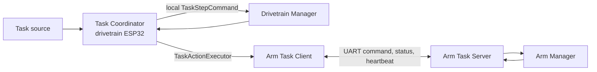
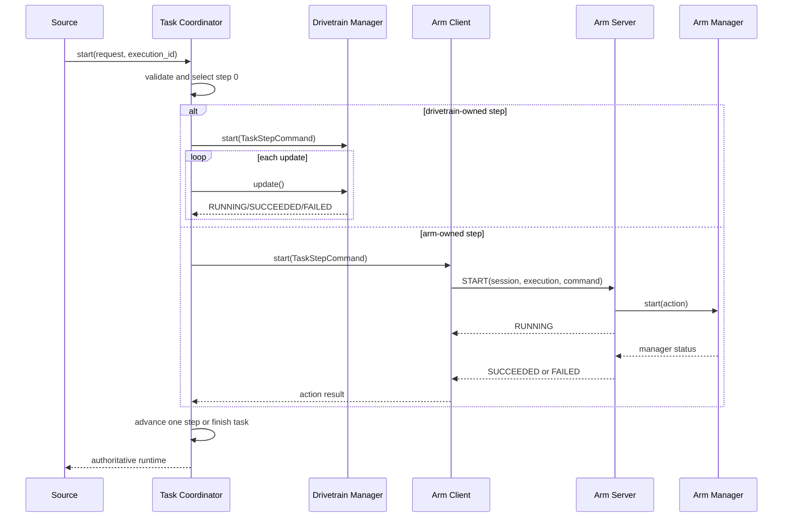

# Task Coordination System

## 1. System overview

The task system turns a high-level request, such as collecting pieces and
building a tower, into an ordered sequence of physical actions. Some actions
belong to the drivetrain ESP32 and others belong to the arm ESP32. The system
must never advance because of an unrelated, duplicated, or stale message.

The drivetrain ESP32 is the coordinator. `TaskCoordinator` is the only object
allowed to own and mutate the current task, current workflow step, task status,
step status, and task failure. The arm ESP32 does not keep a copy of the task.
It keeps only the single arm action command it is currently executing or has
most recently completed so duplicate commands can be answered safely.

The main roles are:

- **Task Coordinator:** validates requests, selects steps, starts the correct
  executor, enforces the step deadline, and performs every task transition.
- **Drivetrain Manager:** accepts drivetrain-owned actions, owns their local
  execution status, and brakes the drivetrain on cancellation or failure.
- **Arm Manager:** accepts arm-owned actions, owns their local execution status,
  and exposes completion/failure reporting to the mechanism-control code.
- **Arm task client/server:** transfer one arm action at a time, correlate
  status with its command, retry safely, detect link loss, and detect resets.
- **UART link:** frames bytes, checks the frame version/checksum, and queues
  decoded packets. It has no knowledge of task transitions.



Only the coordinator can advance `current_step`. A manager can report an action
result, and a communication endpoint can report a link/reset failure, but those
events do not directly edit task state.

## 2. Design decisions

### Coordinator ownership

**Problem:** If both ESP32s advance a task, communication delay can leave them
on different steps.

**Alternatives:** distributed mirrored state, an external coordinator, or one
ESP32 coordinator.

**Decision:** the drivetrain ESP32 is authoritative because the existing task
orchestration and most steps already reside there. The arm is a command server.

**Tradeoff:** a drivetrain reset aborts the in-memory task. This is deliberate;
resuming physical work without persistent and independently verified physical
state would be unsafe.

### One flat workflow

**Problem:** the previous implementation nested a robot routine phase machine
around a second task-step state machine.

**Decision:** each `TaskType` maps directly to one immutable array of
`TaskStepDefinition` entries. The complete tower routine is an eight-step flat
workflow. Standalone tape, picking, and building workflows remain available
because they are current useful operations, not speculative abstractions.

**Tradeoff:** an action such as align-to-tape appears more than once in a
workflow. That is intentional sequence data, not duplicated runtime state.

### Execution ID and command ID

`execution_id` distinguishes two runs of the same task request. The submitting
code supplies a nonzero value. `command_id` is generated by `ArmTaskClient` and
distinguishes separate remote action commands within a coordinator boot
session. The wire key is:

`coordinator_session_id + execution_id + command_id`

The task does not carry a second task ID or revision because `execution_id`
already provides the required identity.

### Owner is derived

The current executor is not stored in `TaskRuntime`. It is derived from the
immutable step definition. Storing both `current_step` and `owner` would create
two values that could disagree.

### Task and step status remain separate

Task status describes the whole execution. Step status describes only the
current physical action. Both are required: after a step succeeds, the task may
still be running while the next step is not started.

### Executor naming

`TaskActionExecutor` is a three-function interface (`start`, `update`,
`cancel`), not another state machine. It lets the coordinator treat a local
manager and the remote arm client identically. Implementations own action
execution; the coordinator owns sequencing.

### Synchronization model

The arm never receives the whole task. It receives one `TaskStepCommand`. This
minimizes wire data and prevents the arm from becoming another source of task
truth. Status messages echo the command identity, and the client ignores any
status that does not match its outstanding command.

### Duplicate and stale messages

The arm server caches the latest accepted command. Receiving the same
execution/command key again returns current status without restarting motion.
A lower/older command ID is rejected as `TASK_FAILURE_STALE_MESSAGE`.

Each controller creates a random nonzero session ID at boot. A changed peer
session is treated as a reset. Each endpoint also remembers the immediately
previous peer session so a delayed pre-reset packet cannot roll synchronization
back to an older session.

### Timeout handling

There are two independent deadlines:

- A 1,000 ms communication timeout detects a silent peer.
- A 30,000 ms coordinator step timeout detects an executor that remains
  running forever even though communication is healthy.

Commands are retried every 200 ms and are safe because duplicate start commands
do not restart the arm action. Heartbeats and periodic status are sent every
250 ms. These values are immutable configuration, not task fields.

### Reset recovery

Automatic resume is intentionally excluded. A reset changes a session ID. The
surviving controller cancels its local action or reports peer reset, and the
coordinator fails the task. Reconnection establishes an idle synchronized link.

### Failure propagation

Managers report stable `TaskFailure` codes. The coordinator maps an executor
failure, rejection, invalid result, timeout, link loss, or reset to one terminal
task failure. It cancels the active executor before publishing the failure when
the executor may still be running.

### Operational state versus diagnostics

Counters for stale messages, retries, protocol errors, duplicates, parser
errors, and dropped packets are diagnostic only. They are never consulted to
advance a task. Session IDs, last-receive time, and the last command key are
recovery/synchronization state and do affect safe behavior.

## 3. File and module responsibilities

```text
firmware/
|-- docs/TASK_SYSTEM_ARCHITECTURE.md
|-- lib/robot-common/
|   |-- include/robot_common/task/task.h
|   |-- include/robot_common/task/task_protocol.h
|   |-- include/robot_common/packet_protocol.h
|   |-- include/robot_common/packet_router.h
|   |-- include/robot_common/uart_link.h
|   |-- src/task/task.c
|   |-- src/task/task_protocol.c
|   |-- src/packet_router.c
|   `-- src/uart_link.c
|-- esp32-drivetrain/
|   |-- include/task/task_action_executor.h
|   |-- include/task/task_coordinator.h
|   |-- include/task/drivetrain_manager.h
|   |-- include/communication/arm_task_client.h
|   |-- include/config/communication/task_link_config.h
|   |-- src/task/task_coordinator.c
|   |-- src/task/drivetrain_manager.c
|   |-- src/communication/arm_task_client.c
|   |-- src/config/communication/task_link_config.c
|   `-- src/main.cpp
`-- esp32-arm/
    |-- include/task/arm_manager.h
    |-- include/communication/task_server.h
    |-- include/config/task_link_config.h
    |-- src/task/arm_manager.c
    |-- src/communication/task_server.c
    |-- src/config/task_link_config.c
    `-- src/main.cpp
```

### Shared task model

`task.h` defines stable cross-controller types. `task.c` owns only request and
shared-enum validation. Workflow arrays, lookup, and command construction are
private to the coordinator rather than exported as unused shared APIs. The
shared model must not own UART, hardware, clock, manager, or transition policy.

### Shared task protocol

`task_protocol.h/.c` define and explicitly encode/decode task command, task
status, and heartbeat payloads. Encoding is fixed little-endian and does not
send raw C structure layouts. The protocol must not advance tasks or operate
hardware.

`packet_protocol.h` assigns the frame-level message types. `uart_link.h/.c`
retain the existing byte framing/parser and now store up to eight decoded
packets in FIFO order. A full queue drops the newly decoded packet and increments
`packets_dropped`; it never silently replaces an older unread command.

### Task Coordinator

`task_coordinator.h/.c` own the private workflow arrays, authoritative
`TaskRuntime`, executor selection, step start, polling, deadline, advancement,
cancellation, and failure. The public API is only `init`, `start`, `update`,
`cancel`, and `fail`; callers that own the coordinator can read its runtime
directly. It must not contain motor, tape-sensor, stepper, claw, or UART
operations.

### Task action executor

`task_action_executor.h` defines the small callback interface. Callback-table
validation is private to the coordinator, its sole caller, so no implementation
file or public validation function is needed.

### Drivetrain Manager

`drivetrain_manager.h/.c` accept only drivetrain actions. Mechanism/application
code reports success or failure through `drivetrain_manager_report_*`. Cancel
and failure brake an initialized drivetrain. It must not select the next action
or send arm messages.

### Arm task client

`arm_task_client.h/.c` own the drivetrain-side task synchronization state,
outstanding remote command, retry schedule, arm session, link deadline, and
diagnostic counters. It implements `TaskActionExecutor` for arm-owned actions.
It must not modify `TaskRuntime` directly; peer failures are pulled by the
composition root and submitted to `task_coordinator_fail()`. It receives only
task status and heartbeat frames selected by the shared `PacketRouter`; it does
not poll or drain the physical UART.

### Arm Manager

`arm_manager.h/.c` accept only pickup and build actions. Mechanism code reports
success/failure. It owns no task sequence, task request, UART, retry, or session.
Its cancellation hook is the place where nonblocking arm mechanism drivers must
be stopped when those drivers are integrated.

### Arm task server

`task_server.h/.c` own arm-side session recognition, duplicate/stale command
handling, heartbeat/status scheduling, communication timeout, and the cached
last command. It delegates physical action state to `ArmManager`. It cannot
advance a workflow or consume packets belonging to other link protocols.

### Configuration and composition roots

The two `task_link_config.*` pairs own fixed timing values. Each `main.cpp`
constructs its board's modules and calls their updates. Drivetrain `main.cpp`
keeps the drivetrain braked at startup; a future task-request source and action
implementation must explicitly enable and command it.

### Removed scaffold

`RobotTaskManager`, `TaskExecutor`, `task_runner`, `tower_task`, and `tape_task`
were removed. They split one workflow across nested state machines and provided
a fake local arm executor on the drivetrain controller. Their stale test suites
were replaced by the coordinator suite.

## 4. Data structures

### `TaskRequest`

| Field | Writer | Reader | Why it exists |
|---|---|---|---|
| `type` | Task source | Validator, workflow lookup | Selects one immutable workflow. |
| `params` | Task source | Command builder and manager | Contains only type-specific immutable execution inputs. |

`TowerRoutineTaskParams` contains `tape_to_pieces` and `tape_to_base`. Each tape
parameter has direction, speed in m/s, and distance in m.

### `TaskRuntime`

| Field | Writer | Reader | Change rule |
|---|---|---|---|
| `execution_id` | Coordinator at acceptance | Managers and protocol | Never changes during a run; nonzero. |
| `request` | Coordinator at acceptance | Workflow/command builder | Immutable during a run. |
| `current_step` | Coordinator only | Workflow lookup, diagnostics | Increments only after current-step success. |
| `status` | Coordinator only | Application/task source | Follows the task transition table. |
| `step_status` | Coordinator only | Application/diagnostics | Reflects the current executor result. |
| `failure` | Coordinator only | Application/diagnostics | `NONE` unless the task failed. |

Owner is deliberately absent and derived from the selected step definition.
`has_task` is unnecessary because `TASK_STATUS_IDLE` represents no execution.

### `TaskStepDefinition`

`action` identifies physical work. `owner` selects drivetrain or arm. Both are
written only in the constant workflow arrays and read by the coordinator.

### `TaskStepCommand`

`execution_id` and `step` identify the coordinator selection. `action` tells the
manager what to execute. `tape_following` contains the only currently defined
action parameters without an extra one-member union. A remote copy is
synchronization state, not another task runtime.

### `TaskCoordinator`

`config` supplies the step timeout. `executors` contains the two manager
interfaces. `runtime` is authoritative task state. `step_started_ms` is required
only to enforce the active-step deadline.

### `DrivetrainManager` and `ArmManager`

Each stores only its current result/status and failure. `RUNNING` itself prevents
overlapping physical actions, so a duplicate `active` flag is unnecessary. The
placeholder managers do not retain an unused command. The drivetrain manager
also stores the drivetrain pointer required for safe braking.

### `ArmTaskClient`

- `link`, `config`: transport and fixed timing dependencies.
- `coordinator_session_id`: this drivetrain boot identity.
- `arm_session_id`, `previous_arm_session_id`: current/reset/stale-session
  detection; zero current session means disconnected.
- `next_command_id`: generates nonzero remote command identities.
- `last_receive_ms`, `last_heartbeat_ms`, `last_command_send_ms`: timeout,
  heartbeat, and retry scheduling.
- `peer_failure`: one safe failure event for the coordinator; `NONE` means no
  pending event.
- `command_active`, `cancel_pending`, `command`, `result`: the one outstanding
  remote action and reliable cancellation state.
- `diagnostics`: stale-status, protocol-error, and retry counters; never used for
  normal transitions.

### `ArmTaskServer`

- `link`, `manager`, `config`: dependencies.
- `arm_session_id`: this arm boot identity.
- `coordinator_session_id`, `previous_coordinator_session_id`: reset and
  old-session rejection; zero current session means disconnected.
- receive/heartbeat/status timestamps: communication scheduling.
- `has_command`, `command`, `last_sent_status`: duplicate handling and periodic
  status reporting.
- `diagnostics`: duplicate, stale-command, and protocol-error counters only.

## 5. Task lifecycle



Request rejection occurs before runtime mutation if the request is invalid,
the execution ID is zero, or another task is running. Executor start rejection
fails an accepted task because physical execution cannot safely proceed.

## 6. State transitions

### Task state

| From | Event | To | Authority |
|---|---|---|---|
| `IDLE` or terminal | Valid nonzero execution request | `RUNNING` | Coordinator |
| `RUNNING` | Last step succeeds | `SUCCEEDED` | Coordinator |
| `RUNNING` | Cancel request | `CANCELLED` | Coordinator |
| `RUNNING` | Executor failure/rejection, invalid result/step, timeout, link loss, reset | `FAILED` | Coordinator |

A new request while `RUNNING` is rejected without changing the active task.
Updates after a terminal state are no-ops.

### Step state

| From | Event | To |
|---|---|---|
| `NOT_STARTED` | Executor accepts start | `RUNNING` |
| `NOT_STARTED` | Executor rejects start | `FAILED` |
| `RUNNING` | Executor reports success | `SUCCEEDED` |
| `RUNNING` | Executor reports failure or deadline expires | `FAILED` |
| `RUNNING` | Task cancellation | `CANCELLED` |
| `SUCCEEDED` | More workflow steps remain | next step `NOT_STARTED` |

An executor result outside running/succeeded/failed/cancelled is a protocol
failure. Managers cannot request a step number or directly transition the task.

## 7. Communication workflow

### Messages

- `TASK_COMMAND`: drivetrain to arm. Contains coordinator session, execution ID,
  command ID, start/cancel type, step, action, and action parameters.
- `TASK_STATUS`: arm to drivetrain. Echoes coordinator session, arm session,
  execution ID, and command ID plus step status and failure.
- `HEARTBEAT`: either direction. Contains sender identity and boot session ID.

The packet frame already supplies protocol version, payload length, and XOR
checksum. Task payloads are explicitly serialized rather than copied from RAM.
Each composition root polls one `PacketRouter`, which dispatches task packet
types to the task endpoint while preserving the same physical `UartLink` for
odometry and future command/data handlers.

### Acknowledgement and retry

`RUNNING` status is the start acknowledgement. Until terminal status arrives,
the client retries the same start key. The server recognizes the duplicate and
returns current status without invoking `arm_manager_start()` again.

Cancellation is also retried until terminal status or peer loss/reset, even
after the coordinator has entered its terminal cancelled/failed state.

### Stale data

The client accepts status only when coordinator session, execution ID, and
command ID match its outstanding action. The server accepts a new command only
when its command ID is newer in the same coordinator session. Packets from the
remembered previous session are rejected.

### Re-synchronization

A newly observed session replaces the current peer session, cancels local work
where applicable, clears the cached command on the arm, and reports peer reset
to the coordinator. No task state is reconstructed across the reset.

## 8. Failure and recovery examples

### Arm reset during an arm step

The coordinator knows an arm command is running. The arm reboots with a new
session and has no action. Its heartbeat exposes the new session. The client
reports `PEER_RESET`; the coordinator fails the task. No retry of the physical
action occurs because the old arm state is unknowable.

### Drivetrain reset during a movement step

The drivetrain hardware reset returns outputs to initialization and the new
firmware keeps the drivetrain braked. The coordinator task disappears and the
new client heartbeat has a new session. The arm server cancels any action from
the previous coordinator session and becomes idle.

### Communication loss after a command

The client retries while the arm may still be executing. After 1,000 ms without
a valid arm message, it reports `LINK_TIMEOUT`; the coordinator fails and asks
the remote executor to cancel. Cancel messages continue to retry. Independently,
the arm server cancels its manager after its own 1,000 ms receive timeout.

### Duplicate start command

The server compares the complete execution/command key with its cached command.
If equal, it increments a diagnostic counter and returns current status. It does
not call the manager start function again.

### Late completion from an older task

The completion execution or command ID does not match the active client command.
The client increments `stale_status_count` and ignores it. The coordinator sees
no success event and cannot advance.

### Subsystem never completes

Healthy heartbeats do not imply physical completion. If a manager remains
running for 30 seconds, the coordinator cancels it and fails the task with
`STEP_TIMEOUT`.

### Subsystem explicitly fails

The manager reports `FAILED` with a nonzero reason. The arm server transfers it
when remote. The coordinator marks the current step and task failed without
advancing and cancels any still-running executor.

## 9. Adding a new task

1. Add a `TaskType` only if the new operation is externally requestable.
2. Add new immutable request parameters to `TaskParams` only if execution needs
   them. Update `task_request_is_valid()`.
3. Reuse an existing `TaskAction` where the physical operation is identical;
   otherwise add one and assign exactly one owner.
4. Add the constant workflow array and return it from `get_workflow()` in
   `task.c`.
5. If the action has parameters, populate them in the coordinator's private
   `build_step_command()` and extend explicit protocol encoding only when the
   action is remote.
6. Implement the action in exactly one manager. Do not add sequencing logic to
   that manager.
7. Add coordinator tests for action order, ownership, success, failure, and
   timeout. Add protocol tests if the remote payload changed.

No changes should be needed in coordinator transition logic, UART framing, or
the other subsystem manager. For example, a new object-placement arm action
changes shared action/request definitions, the arm manager, and tests; it does
not require drivetrain-manager sequencing code.

## 10. Remaining limitations

- The coordination and synchronization architecture is complete, but current
  physical tape/alignment, pickup, and build behaviors are not connected to the
  manager `report_succeeded()` / `report_failed()` APIs. The previous files were
  placeholders and provided no safe hardware behavior to preserve.
- No production task source currently calls `task_coordinator_start()`. A Pi,
  serial command layer, or tape-event policy must supply validated requests and
  monotonically unique execution IDs.
- The drivetrain is initialized but deliberately remains braked at boot.
- `ArmManager` cancellation changes software state; it must stop real mechanism
  outputs when the nonblocking arm mechanism controller is implemented.
- All actions share a 30-second deadline. Hardware testing should establish
  whether per-action deadlines are necessary.
- Reset recovery always aborts. There is no persistent task journal or automatic
  resume.
- Session IDs use `esp_random()` and are not persisted. Collision probability is
  low but not mathematically impossible.
- Only the immediately previous peer session is remembered. This is sufficient
  for normal UART delay across one reset; rejecting packets across many rapid
  resets would require a retained monotonic boot counter or a larger fixed
  history.
- The UART frame uses the existing XOR checksum. CRC-16 is a reasonable later
  hardening step after hardware error-rate measurement.
- The fixed receive queue holds eight packets. Overflow is safe and observable
  but can still cause task failure through timeout.
- Only one task and one action per manager can be active. This is intentional.

Before moving hardware, verify UART wiring, safe brake/coast behavior, arm
cancel behavior, action completion criteria, realistic timeouts, and the source
of execution IDs.

## 11. Developer reading order

1. `firmware/esp32-drivetrain/src/main.cpp` — understand how the coordinator,
   two executors, shared UART router, and update loop are composed.
2. `firmware/lib/robot-common/include/robot_common/task/task.h` — learn the
   authoritative task vocabulary, request/runtime structs, actions, and owners.
3. `firmware/lib/robot-common/src/task/task.c` — read the request validation
   rules shared by both controllers.
4. `firmware/esp32-drivetrain/include/task/task_coordinator.h` followed by
   `firmware/esp32-drivetrain/src/task/task_coordinator.c` — trace the only
   module allowed to define, advance, or terminate a workflow.
5. `firmware/esp32-drivetrain/include/task/task_action_executor.h` — understand
   the header-only boundary that keeps the coordinator independent of physical
   hardware and UART.
6. `firmware/esp32-drivetrain/src/task/drivetrain_manager.c` — see how locally
   owned actions expose completion/failure and enforce fail-safe braking.
7. `firmware/lib/robot-common/include/robot_common/task/task_protocol.h` then
   `firmware/lib/robot-common/src/task/task_protocol.c` — understand explicit
   cross-board command, status, heartbeat, and session serialization.
8. `firmware/lib/robot-common/include/robot_common/packet_router.h` then
   `firmware/lib/robot-common/src/packet_router.c` — see why task messages can
   share one physical UART with odometry and other commands without stealing
   their packets.
9. `firmware/esp32-drivetrain/src/communication/arm_task_client.c` — trace
   retries, link timeouts, arm reset detection, and the remote executor adapter.
10. `firmware/esp32-arm/src/communication/task_server.c` — trace duplicate and
    stale command handling plus delegation to `ArmManager`.
11. `firmware/esp32-arm/src/task/arm_manager.c` — see the arm-side physical
    action boundary and the hooks still awaiting mechanism integration.
12. `firmware/esp32-arm/src/main.cpp` — verify the peer initialization and
    runtime order on the top ESP32.
13. Both `task_link_config.c` files — finish with timing values after knowing
    which timers consume them.
14. `firmware/esp32-drivetrain/test/test_task_coordinator/test_task_coordinator.cpp`
    — use the failure, retry/session, and packet-routing tests as executable
    examples of the intended behavior.
