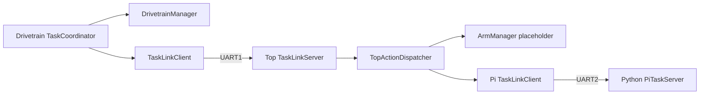

# Task Coordination System

## 1. Feature Overview

The drivetrain ESP32 owns the robot's only top-level `TaskRuntime` and
`TaskCoordinator`. A task is a short coordinator-defined sequence of actions;
each action is executed locally or sent to a remote executor. Managers never
define a second robot workflow.

Implemented top-level tasks are:

| Task | Action | Executor | Current result |
|---|---|---|---|
| Tape following | `TASK_ACTION_FOLLOW_TAPE` | Drivetrain | Physical implementation |
| Tower picking | `TASK_ACTION_PICK_UP_BLOCK` | Top | `TASK_FAILURE_NOT_IMPLEMENTED` |
| Tower building | `TASK_ACTION_BUILD_TOWER` | Top | `TASK_FAILURE_NOT_IMPLEMENTED` |
| Teletubby scan | `TASK_ACTION_SCAN_TELETUBBIES` | Raspberry Pi via top | Camera scan |

The removed alignment and combined-tower workflows had no physical
implementation. Reserved action numbers preserve the existing task-command
wire values.

## 2. System Context

`firmware/esp32-drivetrain/src/main.cpp` initializes the coordinator. The top
composition root owns one router per physical UART. The Pi is an executor of a
single scan action and has no authority to advance the robot workflow.

## 3. Architecture and Layers

- Shared model: task/action/status/failure values and immutable requests.
- Coordinator: authoritative workflow and top-level lifecycle.
- Executor interface: three callbacks for start, update, and cancel.
- Local managers: physical tape following or explicit arm placeholders.
- Reliable task link: session identity, command identity, retry, duplicate
  handling, stale rejection, heartbeat, and reset detection.
- Composition roots: own hardware objects, UARTs, routers, and wiring.

**Documented intent:** one coordinator defines sequences and managers execute
one action. This prevents independent drivetrain, top, and Pi task state
machines from disagreeing.

## 4. Relevant File Map

| File | Role | Why It Exists |
|---|---|---|
| `firmware/lib/robot-common/include/robot_common/task/task.h` | Shared model | Stable public task identities and results |
| `firmware/lib/robot-common/src/task/task.c` | Validation | Rejects invalid tasks/actions at boundaries |
| `firmware/lib/robot-common/include/robot_common/task/task_action_executor.h` | Executor API | Keeps the coordinator independent of transport and hardware |
| `firmware/lib/robot-common/include/robot_common/task/task_protocol.h` | Wire messages | Portable task command/status/heartbeat structures |
| `firmware/lib/robot-common/src/task/task_protocol.c` | Codec | Exact little-endian serialization |
| `firmware/lib/robot-common/src/task/task_link_client.c` | Reliable requester | Retry, timeout, reset, and stale-status behavior |
| `firmware/lib/robot-common/src/task/task_link_server.c` | Reliable executor endpoint | Idempotent command handling and status publication |
| `firmware/esp32-drivetrain/src/task/task_coordinator.c` | Workflow owner | Starts, advances, cancels, times out, and terminates tasks |
| `firmware/esp32-drivetrain/src/task/drivetrain_manager.c` | Local executor | Runs tape following only |
| `firmware/esp32-arm/src/task/arm_manager.c` | Arm executor | Explicit tower-action placeholder |
| `firmware/esp32-arm/src/task/top_action_dispatcher.c` | Ownership adapter | Selects arm or Pi execution for one action |
| `firmware/Rpi/computerVision/uart_link.py` | Pi task endpoint | Python framing and idempotent server |
| `firmware/Rpi/computerVision/teletubby_detector.py` | Scan implementation | Non-blocking task-driven camera inference |

## 5. Design Intent and Rationale

**Documented intent:** `TaskRuntime` is authoritative. Transport clients expose
the same executor interface as local managers, so the coordinator does not know
which actions cross UART.

**Inferred intent:** one `TaskStepParameters` representation keeps numeric
action inputs at the workflow-step boundary. `amount` is a signed distance or
angle, `speed` is its positive magnitude, and `settle_ms` is optional mechanism
settling time. Tape following uses the sign of `amount` for direction; tower
actions use the same fields according to their action identity. This avoids a
type-specific request union for one workflow while keeping workflow defaults in
the coordinator.

**Inferred intent:** separate requester/executor session IDs make boot resets
observable without persistent storage. Execution IDs identify top-level work;
command IDs identify retry-stable link operations.

The terminal safe-state callback is intentionally part of coordinator
composition rather than individual workflows. Every successful, failed,
cancelled, timed-out, reset, or link-lost top-level task therefore requests and
confirms the drivetrain brake. Failure to confirm it changes the task result to
`TASK_FAILURE_SAFE_STATE_FAILED`.

## 6. Initialization Workflow

1. Drivetrain initializes braked hardware, its top UART/router, local manager,
   remote client, safe-state callback, and coordinator.
2. Top initializes optional ToF, the drivetrain UART/router, Pi UART/router,
   arm placeholder, Pi client, dispatcher, and drivetrain-facing server.
3. Pi opens production serial, generates a boot session, loads its configured
   model/camera, and begins sending heartbeats.
4. Clients learn executor sessions from heartbeats before sending physical
   remote work. A missing executor returns `EXECUTOR_UNAVAILABLE` promptly.

## 7. Runtime Workflow

For a Pi scan:

1. The drivetrain coordinator resolves `SCAN_TELETUBBIES` to the top executor.
2. Its client sends a retry-stable task command to top.
3. The top server validates session, execution, command, and action identity.
4. `TopActionDispatcher` starts the Pi client.
5. Pi accepts the command once; duplicates only resend current status.
6. The detector collects unique model class names until the target count or
   deadline is reached.
7. Pi reports success, `TARGET_NOT_FOUND`, or `EXECUTOR_UNAVAILABLE`.
8. The result propagates through top to the drivetrain coordinator.
9. The coordinator enters and confirms the terminal drivetrain safe state.

Cancellation follows the same identity chain in reverse. A reset or link
timeout cancels active downstream work and produces a terminal failure.

## 8. Data Flow

`TaskRequest → TaskCoordinator → TaskStepCommand → TaskActionExecutor → TaskActionResult → TaskRuntime`

The coordinator owns `TaskRuntime`. Each task-link endpoint owns its current
wire command and boot/session synchronization. The top dispatcher owns only a
pointer to the currently selected executor. The Pi owns only its current scan.
`TaskRequest.step_parameter_override_mask` selects which request entries
replace coordinator-owned workflow defaults; the resolved command carries only
one generic `TaskStepParameters` value.

## 9. Control Flow and Scheduling

All ESP modules are polled from Arduino `loop()` and are non-blocking. Each
physical UART is drained by exactly one `PacketRouter`. Task link update calls
perform heartbeat, retry, timeout, and status scheduling. The Pi loop continues
servicing UART while it processes camera frames.

## 10. State and Ownership

- Drivetrain: sole top-level workflow owner.
- Top: owns arm hardware boundary and both of its physical UART objects.
- Pi: owns camera/model state and one scan result.
- `TaskLinkClient`: owns requester session, command ID, retry, and peer state.
- `TaskLinkServer`: owns executor session, duplicate history, and cached result.

## 11. Error and Edge-Case Handling

- Empty tower behavior: explicit `NOT_IMPLEMENTED`, never success or timeout.
- Missing Pi: `EXECUTOR_UNAVAILABLE`.
- No detections before deadline: `TARGET_NOT_FOUND`.
- Duplicate command: cached status; no duplicate action start.
- Duplicate response: accepted idempotently or ignored after completion.
- Old command/session: `STALE_MESSAGE`.
- Malformed or unexpected task result: `PROTOCOL`.
- Executor boot changes: `PEER_RESET`.
- Heartbeat loss/UART failure: `LINK_TIMEOUT`.
- Terminal brake cannot be confirmed: `SAFE_STATE_FAILED`.

The top ToF sensor is currently unrelated to every task. A hard poll failure is
logged once and disables polling until reboot instead of flooding logs or
failing unrelated work.

## 12. Integration with the Rest of the Project

Start with `firmware/esp32-drivetrain/src/main.cpp` and
`firmware/esp32-arm/src/main.cpp` to see concrete ownership. Protocol framing
is shared through `PacketRouter` and `UartLink`; no module independently drains
a link owned by a router.

## 13. Extension Points

Tower motion should replace only `firmware/esp32-arm/src/task/arm_manager.c`
and retain its executor interface. If scanning needs robot motion, add an
explicit drivetrain action and coordinator workflow step. Do not restore raw Pi
steering commands or place drivetrain sequencing inside the Pi.

## 14. Current Limitations and Missing Components

### Confirmed Gaps

- Tower picking/building physical sequences are unimplemented.
- The Pi scan is stationary; it does not sweep or align the drivetrain.
- Hardware behavior and timeout values are unvalidated.
- Higher-level task test harnesses still target the former role-specific APIs
  and are intentionally awaiting replacement.
- `test_task_model` covers shared validation and command serialization, but the
  older integrated coordinator native test still needs its stale paths and
  hardware dependencies repaired.

### Potential Concerns

- Immediate hardware braking may be mechanically abrupt.
- Current Pi package pins require validation on the deployed Raspberry Pi OS.
- Existing encoder PCNT read/clear behavior may lose pulses.

### Recommendations

Validate brake polarity and stopping behavior before motion. Rebuild task-level
tests around the shared client/server rather than textual source inclusion.

## 15. Example Runtime Sequence

1. `task_coordinator_start()` accepts `TASK_TYPE_TOWER_PICKING`.
2. The coordinator sends `PICK_UP_BLOCK` through `TaskLinkClient`.
3. Top dispatches it to `ArmManager`.
4. `arm_manager_start()` accepts ownership and records `NOT_IMPLEMENTED`.
5. The top server publishes the failed result.
6. The drivetrain coordinator fails promptly and confirms the brake.

## 16. Developer Reading Order

1. `firmware/lib/robot-common/include/robot_common/task/task.h`
2. `firmware/lib/robot-common/include/robot_common/task/task_action_executor.h`
3. `firmware/esp32-drivetrain/src/task/task_coordinator.c`
4. `firmware/lib/robot-common/src/task/task_link_client.c`
5. `firmware/lib/robot-common/src/task/task_link_server.c`
6. `firmware/esp32-arm/src/task/top_action_dispatcher.c`
7. Both ESP `src/main.cpp` composition roots
8. `firmware/Rpi/computerVision/uart_link.py`
9. `firmware/Rpi/computerVision/teletubby_detector.py`
