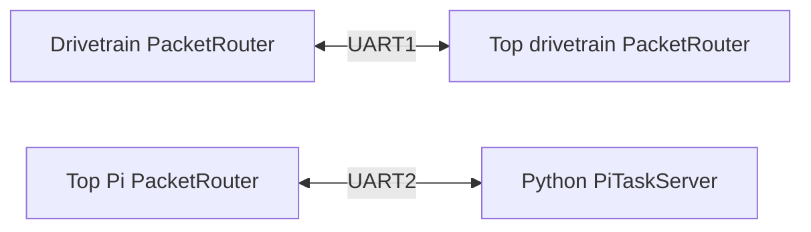

# UART Packet Link System

## 1. Feature Overview

The robot uses the same framed UART transport on two independent physical
links: drivetrain↔top and top↔Pi. Each link has exactly one `UartLink` and one
owner/router. Reliable task semantics are layered above framing.

## 2. System Context

The top never creates two consumers for the drivetrain UART. The removed
`PiBridge` and legacy command/status codecs are not part of production.

## 3. Architecture and Layers

- `uart_link.c`: byte framing, checksum, parser, and hardware I/O.
- `packet_router.c`: the only packet drainer for a shared link.
- `task_protocol.c`: task message serialization and validation.
- `task_link_client.c`: requester reliability and remote executor adapter.
- `task_link_server.c`: duplicate-safe executor endpoint.
- Python `uart_link.py`: byte-compatible Pi implementation.

## 4. Relevant File Map

| File | Role | Why It Exists |
|---|---|---|
| `firmware/lib/robot-common/include/robot_common/packet_protocol.h` | Packet IDs | Stable outer packet namespace |
| `firmware/lib/robot-common/src/uart_link.c` | Framing | Hardware-independent frame state machine around UART I/O |
| `firmware/lib/robot-common/src/packet_router.c` | Dispatch | Enforces one drainer and per-type handlers |
| `firmware/lib/robot-common/src/task/task_protocol.c` | Task codec | Explicit little-endian wire representation |
| `firmware/lib/robot-common/src/task/task_link_client.c` | Client | Heartbeats, retries, and reset detection |
| `firmware/lib/robot-common/src/task/task_link_server.c` | Server | Idempotent execution and cached status |
| `firmware/Rpi/computerVision/uart_link.py` | Python endpoint | Mirrors framing and reliable server behavior |

## 5. Design Intent and Rationale

**Documented intent:** framing is transport-level and task reliability is
message-level. This keeps checksum/parser behavior independent from task
workflow behavior.

**Inferred intent:** the fixed packet and payload layouts permit C and Python
implementations without sharing compiler struct layout or alignment.
The in-memory command uses one generic `amount`, `speed`, and `settle_ms`
tuple. The codec retains the existing 36-byte wire layout, including its legacy
tape slots, so the model can be simplified without changing deployed ESP
packet compatibility. The action identity selects the relevant wire slots.

## 6. Initialization Workflow

1. The composition root initializes a `UartLink` from static pin/baud config.
2. It initializes one `PacketRouter` over that link.
3. It registers task command/heartbeat handlers for a server, or task
   status/heartbeat handlers for a client.
4. Each endpoint generates a nonzero random boot session.
5. Periodic heartbeats establish peer availability and reset identity.

## 7. Runtime Workflow

The router polls its link, validates complete frames, and invokes only the
registered handler for each packet type. Clients encode commands and cache them
for retry. Servers cache the accepted command and latest result so duplicate
commands do not restart work.

## 8. Data Flow

`Task message → task codec → PacketFrame → UartLink bytes → PacketRouter → task codec → task endpoint`

## 9. Control Flow and Scheduling

ESP routers and link endpoints are polled from `loop()`. No task-link module
polls a shared UART itself. Heartbeats run every 250 ms; current ESP link
timeouts are 1 second for drivetrain↔top and 2 seconds for top↔Pi.

## 10. State and Ownership

- The requester owns `requester_session_id` and `command_id`.
- The executor owns `executor_session_id`.
- The drivetrain coordinator owns `execution_id` and step identity.
- One server owns the cached result for duplicate responses.
- One router owns draining each physical UART.

## 11. Error and Edge-Case Handling

Checks cover invalid frame version/type/length/checksum, exact task payload
sizes, zero identities, invalid status/failure combinations, stale sessions,
stale command IDs, unexpected results, heartbeat timeout, link error, and peer
reset. Cancellation uses the original retry-stable command identity.

## 12. Integration with the Rest of the Project

Drivetrain registers a `TaskLinkClient` on its top router. Top registers a
`TaskLinkServer` on that link and a separate `TaskLinkClient` on its Pi router.
The Python endpoint is the server for the scan link.

## 13. Extension Points

New remotely executable actions should reuse task command/status packets. Add
packet types only for data that is not an action lifecycle. Do not independently
call `uart_link_take_packet()` on a link already owned by `PacketRouter`.

## 14. Current Limitations and Missing Components

### Confirmed Gaps

- Byte-level C/Python regression tests are deferred with the higher-level test
  remake.
- Hardware UART wiring has not been validated.

### Potential Concerns

- Timeout values may be too aggressive during slow Pi inference or logging.

### Recommendations

Verify crossed TX/RX, common ground, 3.3 V levels, and real inference latency.

## 15. Example Runtime Sequence

1. Top client sends a scan command to Pi.
2. Pi accepts it and sends `RUNNING`.
3. A retry with the same IDs receives cached `RUNNING` and starts no new scan.
4. Pi sends a terminal result.
5. A duplicate response cannot complete a different execution.

## 16. Developer Reading Order

1. `firmware/lib/robot-common/include/robot_common/packet_protocol.h`
2. `firmware/lib/robot-common/src/uart_link.c`
3. `firmware/lib/robot-common/src/packet_router.c`
4. `firmware/lib/robot-common/include/robot_common/task/task_protocol.h`
5. `firmware/lib/robot-common/src/task/task_link_client.c`
6. `firmware/lib/robot-common/src/task/task_link_server.c`
7. `firmware/Rpi/computerVision/uart_link.py`
