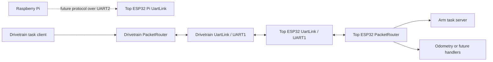

# UART Packet Link System

## 1. Feature Overview

The UART packet link carries multiple logical protocols over the single physical UART between the drivetrain ESP32 and the top/arm ESP32. `UartLink` owns bytes, framing, checksums, and buffering. `PacketRouter` owns receive-side message dispatch. Task synchronization is one consumer alongside odometry and future command/data consumers.

The top ESP32 has a second, electrically independent UART for the Raspberry Pi. Its UART2 configuration is defined, but production code does not initialize it because a Pi packet protocol and handlers have not yet been implemented.

## 2. System Context

`firmware/esp32-drivetrain/src/main.cpp` and `firmware/esp32-arm/src/main.cpp` are the composition roots. Each initializes exactly one `UartLink` and one `PacketRouter` for the ESP32-to-ESP32 cable, then registers the task packet types used on that board.

## 3. Architecture and Layers

- The board configuration layer chooses UART peripheral, pins, baud rate, and driver buffer sizes. It must not parse messages.
- `uart_link.*` is the transport layer. It converts bytes to validated `PacketFrame` values and frames outgoing payloads. It treats payloads as opaque.
- `packet_router.*` is the multiplexing layer. It polls a link once and dispatches each decoded frame by `PacketMessageType`. It must not understand task or odometry payloads.
- `task_protocol.*` is one message protocol. It serializes and validates task payloads without reading UART hardware.
- `arm_task_client.*` and `task_server.*` own task synchronization state. They receive only their registered packet types and share the link for sending.
- The two `main.cpp` files own initialization order and link-error propagation.

## 4. Relevant File Map

| File | Role | Why It Exists |
|---|---|---|
| `firmware/lib/robot-common/include/robot_common/packet_protocol.h` | Shared message IDs and `PacketFrame` | Gives every logical protocol a type on the common link. |
| `firmware/lib/robot-common/include/robot_common/uart_link.h` | Physical link API/state | Separates ESP-IDF UART and framing from application protocols. |
| `firmware/lib/robot-common/src/uart_link.c` | UART framing/parser | Validates version, type, length, and XOR checksum, then queues frames. |
| `firmware/lib/robot-common/include/robot_common/packet_router.h` | Router API/state | Declares per-message handlers for one shared link. |
| `firmware/lib/robot-common/src/packet_router.c` | Receive dispatcher | Prevents one protocol from consuming another protocol's packets. |
| `firmware/lib/robot-common/include/robot_common/task/task_protocol.h` | Task wire model | Declares explicit command, status, and heartbeat payloads. |
| `firmware/lib/robot-common/src/task/task_protocol.c` | Task serialization | Encodes and validates portable little-endian payloads. |
| `firmware/esp32-drivetrain/src/communication/arm_task_client.c` | Drivetrain task consumer | Handles task status/heartbeats and sends commands/retries. |
| `firmware/esp32-arm/src/communication/task_server.c` | Top ESP32 task consumer | Handles task commands/heartbeats and sends arm status. |
| `firmware/esp32-drivetrain/src/config/communication/uart_link_config.c` | Drivetrain UART1 config | Binds UART1 to the top ESP32 pins. |
| `firmware/esp32-arm/src/config/uart_link_config.c` | Top ESP32 UART configs | Binds UART1 to drivetrain and reserves UART2 for the Pi. |
| `firmware/esp32-drivetrain/src/main.cpp` | Drivetrain composition | Initializes and polls the shared router, then updates task state. |
| `firmware/esp32-arm/src/main.cpp` | Top ESP32 composition | Initializes and polls the drivetrain router, then updates the arm task server. |
| `firmware/esp32-drivetrain/test/test_task_coordinator/test_task_coordinator.cpp` | Host tests | Verifies task behavior and separation of task/odometry routes. |

`UartLinkConfig` belongs in board-specific config files because peripherals and pins differ. `UartLink` and `PacketRouter` belong in `robot-common` because their logic is protocol- and board-independent. Task retry/session logic stays outside both shared transport modules.

## 5. Design Intent and Rationale

**Documented intent:** the ESP32-to-ESP32 UART carries state exchange plus other commands/data. The router enforces this by assigning packet types to consumers rather than letting the task layer drain the entire receive queue.

**Inferred intent:** keeping `uart_link_send()` generic appears intended to let odometry, tasks, and later message families share identical framing. The benefit is one parser and one wire envelope; the tradeoff is that message type IDs and payload limits are shared protocol resources.

**Documented intent:** the top ESP32 also has a Pi UART. It remains a separate `UartLink` because it has different pins, a different peripheral, and a different peer. “Combining” the links means reusing the same transport/router architecture, not merging two physical UART drivers into one object.

**Inferred intent:** polling in the composition root creates one owner for receive draining and makes ordering visible. Task modules still hold a non-owning link pointer for transmission, avoiding duplicate send wrappers or a second UART driver.

The apparent architectural goals are one physical-link owner, reusable framing, explicit message dispatch, protocol-local state, and no duplicated receive loops.

## 6. Initialization Workflow

1. The board initializes logging and required hardware.
2. `uart_link_init()` installs/configures UART1 from the board's link config.
3. The task client/server is initialized with a non-owning pointer to that link.
4. `packet_router_init()` binds a router to the same link.
5. The composition root registers task status plus heartbeat on drivetrain, or task command plus heartbeat on the top ESP32.
6. The remaining managers/coordinator are initialized.
7. `application_ready` is set only after every required dependency succeeds.

UART configuration failures roll back the driver inside `uart_link_init()`. Router registration failures stop application startup. The Pi UART configuration is available but is not part of this startup sequence yet.

## 7. Runtime Workflow

Each loop first calls `packet_router_update()`. It performs one bounded UART read, lets `UartLink` parse bytes, removes each complete frame from the transport queue, and invokes the handler registered for its type. Task handlers validate their payload and update session/command state. After routing, the task client/server update function runs timers, retries, status publication, and timeouts.

An unregistered but structurally valid packet is counted in `PacketRouter.packets_unhandled` and discarded. A registered malformed task payload reaches the task handler and increments that module's protocol-error diagnostics. A UART polling error is returned to `main.cpp`, which immediately tells the task client/server to enter its safe link-failure behavior.

## 8. Data Flow

Receive path:

`ESP-IDF UART RX -> UartLink parser -> PacketFrame queue -> PacketRouter type lookup -> task/odometry/future consumer`

Transmit path:

`Task or data encoder -> PacketFrame payload/type -> uart_link_send() -> framed UART bytes`

`UartLink` owns parser state and its eight-frame queue. `PacketRouter` owns handler/context pointers and routing counters. Task client/server objects own sessions, timeouts, retries, and command state. Configuration objects have static lifetime and are referenced by `UartLink` for its entire initialized lifetime.

## 9. Control Flow and Scheduling

Both applications use the Arduino `loop()`. UART reads are nonblocking and bounded to four 256-byte batches per update. Routing is synchronous: handlers finish before the next queued frame is dispatched. There are no RTOS locks, so link polling and route registration are expected to occur from one application context. Handler registration is startup work, not a concurrent runtime operation.

## 10. State and Ownership

- One `UartLink` instance owns one installed UART driver and parser.
- One `PacketRouter` drains one `UartLink`; protocol modules must not also call `uart_link_take_packet()` on that link.
- The composition root owns both objects and their lifetime.
- Registered consumers own their protocol state but not the router or UART.
- `PI_UART_LINK_CONFIG` is immutable configuration only; there is currently no production Pi `UartLink` runtime object.

Deinitializing a link clears its queue, parser, counters, and config pointer. The current production applications do not deinitialize because their lifetime matches the device boot.

## 11. Error and Edge-Case Handling

- Invalid config, zero baud, duplicate initialization, and ESP-IDF driver failures are returned by `uart_link_init()`.
- Bad magic/version/type/length/checksum data is rejected by the streaming parser and counted.
- Queue overflow drops the newest completed packet and increments `packets_dropped`.
- Invalid route types are rejected during registration.
- Unregistered valid packet types are counted as unhandled, making missing integration observable.
- Malformed task payloads are rejected by `task_protocol_decode_*()` and counted by the task endpoint.
- Link read errors immediately cancel/fail task-side work through the composition root.

There is no retransmission at the generic transport layer. Task commands implement protocol-specific retries because only that layer understands idempotency.

## 12. Integration with the Rest of the Project

The task coordinator uses `ArmTaskClient` as a `TaskActionExecutor`; it does not know that UART is involved. `ArmTaskServer` delegates accepted commands to `ArmManager`. `odometry_packet_send()` already shares `uart_link_send()` and needs no transport changes. A receive-side odometry module can register `PACKET_TYPE_ODOMETRY` with the existing router.

The best integration trace is `main.cpp -> packet_router_update() -> arm_task_*_process_packet() -> task_protocol_decode_*()` for receive, and `arm_task_* -> task_protocol_encode_*() -> uart_link_send()` for transmit.

## 13. Extension Points

To add another ESP32-link message, add a stable `PacketMessageType`, implement its encoder/decoder in a protocol-specific module, and register its handler in each composition root that consumes it. `uart_link.*`, the task protocol, and task state machines should remain unchanged.

To enable the Pi link, create a separate `UartLink` instance using `PI_UART_LINK_CONFIG`, create a separate `PacketRouter`, define the Pi-facing protocol/ownership rules, register handlers, then poll that router from the top ESP32 loop. Forwarding a Pi message to the drivetrain should be an explicit bridge handler; raw byte forwarding would bypass framing and ownership rules.

## 14. Current Limitations and Missing Components

### Confirmed Gaps

- The Pi UART has pins/configuration but no initialized runtime link, protocol, router, or handlers.
- Production code does not yet register an odometry receive handler.
- Packet framing uses XOR rather than a stronger CRC.
- The fixed queue can overflow during bursts.

### Potential Concerns

- Synchronous handlers must remain short; a blocking future handler could delay all protocols on the link.
- A single handler per message type is intentional ownership, but broadcast-style telemetry would need a deliberate fan-out consumer.
- UART1/UART2 pin/peripheral assignments require hardware validation on the actual top-board revision.

### Recommendations

Define the Pi command protocol and direction/authorization model before enabling UART2. Add per-protocol receive tests when odometry or Pi forwarding is integrated. Consider CRC-16 after measuring real-link error behavior.

## 15. Example Runtime Sequence

1. Drivetrain `loop()` calls `packet_router_update(&arm_packet_router, now_ms)`.
2. `uart_link_update()` parses an arm heartbeat followed by an odometry packet.
3. `PacketRouter` sends the heartbeat only to `arm_task_client_process_packet()`.
4. A registered odometry handler, when added, receives only the odometry packet.
5. `arm_task_client_update()` checks its timeout/retry timers.
6. The task coordinator reads any resulting peer failure or arm action status.
7. Neither consumer can remove the other consumer's packet.

## 16. Developer Reading Order

1. `firmware/esp32-drivetrain/src/main.cpp` — see the complete ownership and update order before reading internals.
2. `firmware/lib/robot-common/include/robot_common/packet_protocol.h` — learn the shared message namespace and `PacketFrame` boundary.
3. `firmware/lib/robot-common/include/robot_common/uart_link.h` — learn physical link configuration, parser state, queue ownership, and public transport operations.
4. `firmware/lib/robot-common/src/uart_link.c` — follow framing, checksum validation, bounded polling, and queue behavior.
5. `firmware/lib/robot-common/include/robot_common/packet_router.h` — understand how a logical protocol claims a packet type.
6. `firmware/lib/robot-common/src/packet_router.c` — see the single receive-drain loop and dispatch behavior.
7. `firmware/lib/robot-common/include/robot_common/task/task_protocol.h` then `firmware/lib/robot-common/src/task/task_protocol.c` — learn task messages as one payload family on the generic link.
8. `firmware/esp32-drivetrain/src/communication/arm_task_client.c` — trace drivetrain-side session, retry, and status handling.
9. `firmware/esp32-arm/src/communication/task_server.c` — trace the matching top-side command and status behavior.
10. Both `uart_link_config.c` files — compare board-specific UART1 wiring, then note the top ESP32's separate UART2 Pi configuration.
11. `firmware/esp32-arm/src/main.cpp` — close the loop by seeing the peer router registrations and scheduling order.
12. `firmware/esp32-drivetrain/test/test_task_coordinator/test_task_coordinator.cpp` — confirm the expected separation between task and other packet types.
