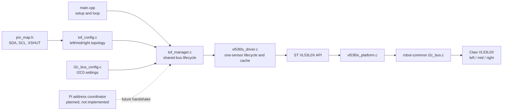

# Arm Time-of-Flight System

## 1. Feature Overview

The arm time-of-flight (ToF) subsystem acquires distance measurements from three VL53L0X sensors mounted left, middle, and right on one claw. All three sensors share the arm ESP32's I2C bus and boot at the same 7-bit address, `0x29`. The current implementation prevents address collisions by keeping the left and right sensors in shutdown, assigning the always-on middle sensor address `0x31`, and then booting and assigning the left and right sensors addresses `0x30` and `0x32`.

The subsystem initializes and calibrates the sensors, starts continuous ranging, polls without waiting for a measurement, and caches a timestamped sample per sensor. It does not interpret claw geometry, fuse the measurements, detect an object, or control the arm.

The production entry point initializes and polls the subsystem. No application logic currently calls `vl53l0x_driver_get_sample()` or consumes the cached ranges.

**Documented future intent:** Address assignment will later be performed by the Pi. The Pi and arm ESP will need to coordinate during initialization so that the ESP does not initialize or start ranging until address assignment is complete. That handshake, its transport, and its failure behavior are not implemented yet.

## 2. System Context

`firmware/esp32-arm/src/main.cpp` owns the `TofManager` instance. During `setup()`, it initializes the manager from `ARM_TOF_CONFIG` and starts ranging. During `loop()`, it calls `tof_manager_poll()` approximately once per millisecond, subject to Arduino and I2C scheduling.

External dependencies are the three VL53L0X devices, their shared I2C wiring, the left/right XSHUT connections, the ESP-IDF I2C/GPIO/timer APIs, FreeRTOS delays, `robot-common` I2C wrappers, and the bundled ST VL53L0X API.

The Pi UART pins exist in `pin_map.h`, but no Pi UART link configuration, protocol, or ToF initialization messages currently exist. The diagram therefore shows the Pi only as a planned connection.

## 3. Architecture and Layers

### Application integration

`firmware/esp32-arm/src/main.cpp` determines when the subsystem initializes and polls. It should remain responsible for application scheduling and failure policy, not register-level sensor operations.

### Board configuration

`tof_config.h/.c`, `i2c_bus_config.h/.c`, and `pin_map.h` describe the arm board topology: logical sensor IDs, addresses, profiles, timing, I2C settings, and GPIO assignments. Mutable sensor state does not belong in these files.

### Group lifecycle

`tof_manager.h/.c` owns one shared `I2cBus` and exactly three `VL53L0X` objects. It validates the topology, prevents boot-address collisions, orders initialization, starts and stops the group, polls the group, and rolls back partial startup. Register operations and application decisions remain outside this layer.

### Device driver

`vl53l0x_driver.h/.c` manages one sensor. It connects the ST API to one `I2cDevice`, changes the address, calibrates the sensor, applies a ranging profile, manages continuous ranging, and caches samples. It has no knowledge of left/middle/right meanings.

### Vendor API and transport port

`lib/st-vl53l0x-api` supplies ST's device API and the project-specific transport adapter. `vl53l0x_platform.c` translates ST register transactions to `robot-common` I2C calls. Board topology and group ordering remain outside the vendor layer.

## 4. Relevant File Map

| File | Role | Why It Exists |
|---|---|---|
| `firmware/esp32-arm/src/main.cpp` | Application entry point | Initializes, starts, and repeatedly polls the claw sensors. |
| `firmware/esp32-arm/include/config/pin_map.h` | Pin configuration | Defines I2C SDA/SCL and left/right XSHUT pins. |
| `firmware/esp32-arm/include/config/i2c_bus_config.h` | I2C configuration interface | Exposes the arm sensor bus configuration. |
| `firmware/esp32-arm/src/config/i2c_bus_config.c` | I2C configuration | Selects I2C0, GPIO 7/8, 100 kHz, 50 ms timeout, and external pull-ups. |
| `firmware/esp32-arm/include/config/tof_config.h` | ToF topology interface | Defines `ArmTofId` and exposes `ARM_TOF_CONFIG`. |
| `firmware/esp32-arm/src/config/tof_config.c` | ToF topology | Maps left/mid/right to addresses, shutdown pins, and ranging settings. |
| `firmware/esp32-arm/include/control/time_of_flight/tof_manager.h` | Group API and state | Declares the fixed three-sensor manager and lifecycle API. |
| `firmware/esp32-arm/src/control/time_of_flight/tof_manager.c` | Group implementation | Sequences shared-address startup and group polling. |
| `firmware/esp32-arm/include/drivers/time_of_flight/tof_device.h` | Shared device configuration | Holds boot address, runtime address, and shutdown pin. |
| `firmware/esp32-arm/include/drivers/time_of_flight/vl53l0x_driver.h` | Sensor API and types | Declares profiles, samples, runtime state, and driver functions. |
| `firmware/esp32-arm/src/drivers/time_of_flight/vl53l0x_driver.c` | Sensor implementation | Implements address changes, calibration, ranging, and sample caching. |
| `firmware/lib/robot-common/include/robot_common/i2c_bus.h` | Shared I2C abstraction | Declares bus/device state and I2C transactions used by the ST port. |
| `firmware/lib/robot-common/src/i2c_bus.c` | Shared I2C implementation | Wraps ESP-IDF I2C master setup and transactions. |
| `firmware/esp32-arm/lib/st-vl53l0x-api/library.json` | Vendor package manifest | Tells PlatformIO which ST and platform sources to build. |
| `firmware/esp32-arm/lib/st-vl53l0x-api/src/platform/vl53l0x_platform.h` | ST platform interface | Extends the ST device context with an `I2cDevice` pointer. |
| `firmware/esp32-arm/lib/st-vl53l0x-api/src/platform/vl53l0x_platform.c` | ST transport adapter | Converts ST reads/writes into `robot-common` I2C operations. |
| `firmware/esp32-arm/lib/st-vl53l0x-api/src/platform/vl53l0x_platform_log.h` | ST logging configuration | Supplies logging definitions expected by the vendor API. |
| `firmware/esp32-arm/lib/st-vl53l0x-api/src/platform/vl53l0x_types.h` | ST platform types | Supplies platform types expected by the vendor API. |
| `firmware/esp32-arm/lib/st-vl53l0x-api/src/core/inc/*.h` | ST public/internal headers | Declare the vendor API, device state, tuning values, ranging, calibration, and error strings. |
| `firmware/esp32-arm/lib/st-vl53l0x-api/src/core/src/*.c` | ST implementation | Implements the vendor API, calibration, ranging, core algorithms, and strings. |
| `firmware/esp32-arm/platformio.ini` | Build integration | Adds `../lib` and builds the local ST library for each arm environment. |

### Configuration details

`ArmTofId` gives stable indices: `ARM_TOF_LEFT`, `ARM_TOF_MID`, and `ARM_TOF_RIGHT`. `sensor_configs` uses the same ordering, and a static assertion keeps `ARM_TOF_COUNT` equal to `TOF_SENSOR_COUNT`.

`ARM_TOF_CONFIG` retains pointers to static-lifetime bus and sensor configuration. Left uses GPIO 43 and address `0x30`; middle has no ESP-controlled shutdown pin and uses `0x31`; right uses GPIO 44 and address `0x32`. All use the default profile, a 33 ms timing budget, a 100 ms stop timeout, and a 150 ms freshness limit.

### Manager and driver details

`TofManager` owns runtime bus state and the three `VL53L0X` objects. Its API provides `init`, `start`, `poll`, `stop`, and `deinit` operations.

Each `VL53L0X` owns its I2C device context, ST context, cached `VL53L0XSample`, and lifecycle flags. `vl53l0x_driver_get_sample()` copies a fresh cached sample to a caller; it does not perform I2C.

### Vendor file details

The compiled ST source files are:

- `src/core/src/vl53l0x_api.c`
- `src/core/src/vl53l0x_api_calibration.c`
- `src/core/src/vl53l0x_api_core.c`
- `src/core/src/vl53l0x_api_ranging.c`
- `src/core/src/vl53l0x_api_strings.c`
- `src/platform/vl53l0x_platform.c`

Paths in this list are relative to `firmware/esp32-arm/lib/st-vl53l0x-api`. The remaining headers support those compiled units and should be treated as bundled vendor code rather than arm feature policy.

## 5. Design Intent and Rationale

### Fixed three-sensor manager

**Documented intent:** The claw has exactly three VL53L0X sensors: left, middle, and right. `TOF_SENSOR_COUNT` and the embedded sensor array keep this topology explicit and remove the mixed-device and caller-storage machinery used by the drivetrain subsystem.

The benefit is a small API and obvious ownership. The tradeoff is that changing the sensor count requires recompilation and coordinated edits to the manager and topology enum.

### Configuration separated from runtime state

**Inferred intent:** Static board facts live in `config`, while `TofManager` and `VL53L0X` own mutable state. This keeps GPIO/address changes out of lifecycle code and lets the driver remain independent of claw positions. The implementation follows this boundary consistently.

### Shared manager above a single-device driver

**Inferred intent:** Address collision avoidance is a group concern, while calibration and ranging are device concerns. This division prevents the generic driver from knowing about the other two sensors and keeps shared-bus ordering in one place.

### Non-blocking runtime polling

**Inferred intent:** `vl53l0x_driver_read()` checks readiness and returns `ESP_ERR_NOT_FINISHED` instead of waiting for a measurement. This lets the main loop continue quickly. Initialization, calibration, address delays, and stop completion remain blocking operations because they are lifecycle operations.

### Planned Pi-owned address assignment

**Documented intent:** The current ESP-owned address sequence is temporary. A future version will let the Pi perform address changes and will add Pi/ESP initialization communication.

The responsibility split is not yet defined. In particular, it is unclear which processor will control XSHUT, which physical bus the Pi will use to reach the sensors, which ESP-Pi transport will carry readiness/failure messages, and whether the ESP will still run ST initialization and calibration after the Pi assigns addresses. These decisions must be made together because `vl53l0x_driver_init()` currently combines boot, address assignment, ST initialization, calibration, and profile setup.

The subsystem's apparent architectural goals are concise fixed-topology management, clear separation between board policy and device operations, safe shared-address startup, and non-blocking acquisition.

## 6. Initialization Workflow

Current initialization is:

1. Static `tof_manager` storage begins zero-initialized in `main.cpp`.
2. `setup()` calls `tof_manager_init(&tof_manager, &ARM_TOF_CONFIG)`.
3. `config_is_valid()` checks required pointers, distinct runtime addresses, no runtime address equal to its boot address, and at most one always-on sensor.
4. The manager configures each controllable XSHUT pin as an output and drives it low.
5. The manager waits 5 ms and initializes I2C0 from `SENSOR_I2C_BUS_CONFIG`.
6. The manager first selects devices without an XSHUT pin. This initializes the middle sensor at `0x29`, assigns it `0x31`, calibrates it, and applies its profile.
7. The manager selects controlled devices. The VL53L0X driver raises each XSHUT pin individually, waits for boot, initializes the device at `0x29`, then assigns left `0x30` and right `0x32`.
8. On any device failure, initialized sensors are deinitialized in reverse order, controlled sensors are held low, the bus is released, and the manager is cleared.
9. On success, `manager->initialized` becomes true.
10. `setup()` calls `tof_manager_start()`, which starts continuous ranging on all sensors. A partial start is rolled back by stopping sensors already started.

`ESP_ERROR_CHECK` aborts the production firmware when initialization or startup fails.

### Planned initialization change

The future workflow must insert a Pi/ESP coordination boundary before ESP ranging begins. The exact sequence is not implemented. At minimum, the ESP needs an unambiguous success/failure result and the final address mapping before it constructs usable per-sensor I2C/ST contexts. The current `vl53l0x_driver_init()` cannot simply be called unchanged after external address assignment because it starts from the boot address and calls `VL53L0X_SetDeviceAddress()` itself.

## 7. Runtime Workflow

After startup, Arduino calls `loop()` repeatedly:

1. `tof_manager_poll()` verifies that the manager is initialized and ranging.
2. The manager calls `vl53l0x_driver_read()` once for each sensor.
3. The driver queries measurement readiness through the ST API.
4. A not-ready sensor returns `ESP_ERR_NOT_FINISHED`; the manager continues polling the other sensors.
5. A ready sensor supplies range data. The driver clears the sensor interrupt and caches distance, range status, timestamp, and validity.
6. The manager returns `ESP_OK` when at least one sensor updated, `ESP_ERR_NOT_FINISHED` when none updated, or the first device error encountered.
7. `loop()` ignores normal not-ready results, aborts on other errors, delays 1 ms, and repeats.

Consumers can call `vl53l0x_driver_get_sample(&tof_manager.sensors[id], &sample)`. No current production consumer does so.

## 8. Data Flow

`VL53L0X hardware -> ST API -> vl53l0x_platform.c -> robot-common I2C -> vl53l0x_driver_read() -> VL53L0X.sample -> future claw logic`

- `ARM_TOF_CONFIG` is declared in `tof_config.h`, defined in `tof_config.c`, and has static lifetime. The manager stores a pointer to it.
- `TofManager` is declared at file scope in `main.cpp` and lives for the firmware's lifetime.
- `TofManager.sensors[id]` owns the mutable state for each logical claw position.
- `VL53L0XSample` is written only by `vl53l0x_driver_read()` and copied by value to callers through `vl53l0x_driver_get_sample()`.
- `valid` reports ST range status zero; freshness is enforced separately using `timestamp_us` and `stale_after_ms`.
- The planned Pi handshake has no message type or state structure yet.

## 9. Control Flow and Scheduling

`setup()` runs initialization and startup once. Those calls block during shutdown/boot delays, ST calibration, address-set delays, I2C operations, and potentially stop completion during rollback.

`loop()` polls repeatedly with a 1 ms delay. A sensor's configured 33 ms timing budget bounds measurement production more strongly than the loop delay; polling more often does not create a new sample more often. No dedicated RTOS task, callback, interrupt handler, mutex, or explicit update frequency exists.

The manager and drivers assume single-threaded access. Calling lifecycle or sample functions concurrently would require synchronization not currently provided.

## 10. State and Ownership

`main.cpp` owns the static `TofManager`. The manager owns:

- A pointer to immutable `TofManagerConfig`.
- The initialized `I2cBus` state.
- Three `VL53L0X` states.
- Group-level `initialized` and `ranging` flags.

Each sensor state references its immutable `VL53L0XConfig` and owns its `I2cDevice`, vendor context, cached sample, and lifecycle flags. Configuration pointers remain valid because all configuration is static.

`tof_manager_deinit()` stops ranging, deinitializes sensors in reverse order, releases the I2C bus, and clears the manager. The production application does not currently call it because it runs indefinitely.

On initialization failure, the manager attempts to restore the middle sensor's boot address, powers controlled sensors down, releases the bus, and clears state. On runtime polling failure, the production loop aborts rather than recovering.

## 11. Error and Edge-Case Handling

- Null pointers, missing configuration, duplicate runtime addresses, runtime addresses equal to boot addresses, and multiple always-on devices are rejected before bus initialization.
- Invalid driver profiles, invalid addresses, too-small timing budgets, and zero timeouts are rejected by the device driver.
- Calling lifecycle methods in the wrong state returns `ESP_ERR_INVALID_STATE`.
- ST invalid-parameter, timeout, and unsupported-mode errors are mapped to corresponding `esp_err_t` values; other ST failures become `ESP_FAIL`.
- A sensor without a ready measurement returns `ESP_ERR_NOT_FINISHED`, which is normal and nonfatal.
- A completed measurement with a nonzero ST range status is cached with `sample.valid == false`; acquisition itself still returns success.
- Cached data older than 150 ms is rejected by `vl53l0x_driver_get_sample()`.
- Stop completion is polled until the configured 100 ms deadline.
- Partial initialization and partial start are rolled back.
- Production initialization and runtime I2C failures cause `ESP_ERROR_CHECK` to abort; there is no retry or degraded two-sensor mode.
- There is no timeout, retry, or fallback design for the future Pi handshake because that handshake is not implemented.

## 12. Integration with the Rest of the Project

The current integration path is:

`main.cpp -> ARM_TOF_CONFIG -> TofManager -> VL53L0X driver -> ST API -> robot-common I2C`

The best symbols to trace are `setup()`, `tof_manager_init()`, `vl53l0x_driver_init()`, `tof_manager_poll()`, and `vl53l0x_driver_read()`.

The subsystem currently shares only the general `robot-common` library with the rest of the robot software. It does not send ToF data to the drivetrain or Pi, and it does not feed arm control logic.

GPIO 38/39 are labeled for Pi UART in `pin_map.h`, but no corresponding UART configuration or application integration exists. The existing `DRIVETRAIN_UART_LINK_CONFIG` targets the drivetrain connection and must not be assumed to implement Pi communication.

## 13. Extension Points

### Add Pi-owned address assignment

Likely changes include `tof_manager.c`, `vl53l0x_driver.c/.h`, `main.cpp`, Pi-link configuration, and new protocol/message files. Preserve `VL53L0XSample` and the runtime read/start API where possible. Separate address attachment from sensor calibration so the ESP can bind to an already-addressed device without repeating `VL53L0X_SetDeviceAddress()`.

### Consume claw distances

Add claw logic above the manager and read samples using `ArmTofId` plus `vl53l0x_driver_get_sample()`. Keep object detection and actuator decisions out of the hardware driver.

### Change pins, addresses, or ranging behavior

Edit `pin_map.h` for GPIOs and `tof_config.c` for address/profile/timing changes. Manager and driver interfaces should remain stable.

### Add diagnostics and tests

A hardware diagnostic environment can print all three cached samples and initialization state. Host tests can cover manager topology/state logic once GPIO, timing, I2C, and driver calls are injected or stubbed; the current manager directly calls hardware functions.

## 14. Current Limitations and Missing Components

### Confirmed Gaps

- Pi-owned address assignment and the Pi/ESP initialization handshake are not implemented.
- No transport, messages, state machine, timeout, retry, or ownership rules exist for that handshake.
- No production feature consumes the three cached distance samples.
- No ToF-specific tests or hardware diagnostic harness exist in the arm firmware.
- The production loop aborts on runtime sensor errors and provides no recovery mode.
- The middle sensor has no ESP-controlled shutdown pin, so the ESP cannot independently power-cycle it.

### Potential Concerns

- GPIO 43/44 are configured for left/right XSHUT, but their match to the final arm wiring needs hardware confirmation.
- The future Pi design may conflict with the current ESP-owned I2C bus. This depends on whether the Pi directly shares the sensor bus or only coordinates over UART.
- Multiple VL53L0X emitters may interfere optically when ranging together. No observed hardware data or scheduling requirement currently confirms whether this is a problem.
- Public access to `TofManager.sensors` is simple but exposes internal state; this is acceptable for the current fixed subsystem but may complicate future encapsulation.

### Recommendations

1. Define the future Pi/ESP sequence before changing code: XSHUT owner, sensor-bus owner, transport, message format, timeouts, retry behavior, and final address mapping.
2. Split driver initialization into address attachment and sensor setup when implementing Pi ownership.
3. Add a small three-sensor hardware diagnostic before connecting the readings to claw control.
4. Confirm GPIO 43/44 and external I2C pull-ups against the final schematic.

## 15. Example Runtime Sequence

1. `setup()` calls `tof_manager_init()` with `ARM_TOF_CONFIG`.
2. The manager holds left and right in shutdown and initializes I2C0.
3. `vl53l0x_driver_init()` assigns the middle sensor `0x31`.
4. The manager boots and initializes left at `0x30`, then right at `0x32`.
5. `setup()` calls `tof_manager_start()` for all three sensors.
6. `loop()` calls `tof_manager_poll()`.
7. Suppose only the middle sensor is ready: its driver caches the range, while left and right return `ESP_ERR_NOT_FINISHED`.
8. The manager returns `ESP_OK`, `loop()` delays 1 ms, and polling repeats.
9. Future claw logic can copy the middle sample with `vl53l0x_driver_get_sample(&tof_manager.sensors[ARM_TOF_MID], &sample)`.

## 16. Developer Reading Order

1. `firmware/esp32-arm/src/main.cpp` — learn when initialization, startup, and polling occur.
2. `firmware/esp32-arm/include/config/tof_config.h` — learn the logical left/mid/right IDs used by consumers.
3. `firmware/esp32-arm/src/config/tof_config.c` — learn the physical topology, addresses, shutdown arrangement, and ranging settings.
4. `firmware/esp32-arm/include/control/time_of_flight/tof_manager.h` — learn group ownership and the public lifecycle.
5. `firmware/esp32-arm/src/control/time_of_flight/tof_manager.c` — trace collision-free startup, polling, rollback, and the planned Pi handoff note.
6. `firmware/esp32-arm/include/drivers/time_of_flight/vl53l0x_driver.h` — learn the one-device configuration, state, sample, and API.
7. `firmware/esp32-arm/src/drivers/time_of_flight/vl53l0x_driver.c` — trace ST initialization, current ESP address assignment, ranging, and caching.
8. `firmware/esp32-arm/src/config/i2c_bus_config.c` and `firmware/esp32-arm/include/config/pin_map.h` — confirm the concrete bus and GPIO wiring.
9. `firmware/esp32-arm/lib/st-vl53l0x-api/src/platform/vl53l0x_platform.c` — see how ST register operations reach the project I2C abstraction.
10. `firmware/lib/robot-common/src/i2c_bus.c` — see the final ESP-IDF I2C transactions.
11. `firmware/esp32-arm/lib/st-vl53l0x-api/src/core/inc/vl53l0x_api.h` — consult the vendor API only when changing low-level sensor behavior.
