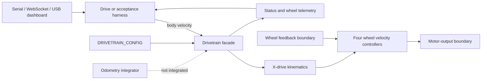

# Drivetrain System

## 1. Feature Overview

The drivetrain subsystem accepts a robot-body velocity request (`vx`, `vy`, and
`omega`), converts it into four X-drive wheel targets, closes one velocity loop
per wheel, and applies bounded outputs through the hardware layer. It also owns
the shared brake, lifecycle state, command watchdog, live PI tuning, and wheel
telemetry.

The implemented control path is usable from the `drive` and `drivetrain-test`
harnesses. The repository's default firmware is not yet a production drivetrain
application: `src/main.cpp` is a two-motor bench program. Odometry exists as a
tested pose-integration primitive but is not connected to wheel feedback or the
drivetrain facade.

Primary input: bounded body-frame velocity commands. Primary output: four signed
PWM duty requests. Secondary outputs: lifecycle status, targets, measured wheel
speeds, counts, and applied duty telemetry.

## 2. System Context

`DRIVETRAIN_CONFIG` composes hardware references, `x_drive_kinematics` geometry,
`wheel_controller` defaults, motion bounds, timing limits, and brake
configuration. A harness statically owns
a `Drivetrain`, calls `drivetrain_init`, then `drivetrain_enable`, periodically
refreshes a command, and calls `drivetrain_update`.

## 3. Architecture and Layers

### Configuration

`drivetrain_config.*` owns the single complete configuration passed into the
facade. It should contain calibrated constants and safety policy, not runtime
state or hardware operations.

### Pure control math

`x_drive_kinematics.*`, `wheel_velocity_controller.*`, and `odometry.*` do not directly
touch ESP32 peripherals. They own geometry transforms, one-wheel regulation,
and pose integration respectively. These are the most reusable and best-tested
parts of the subsystem.

### Drivetrain facade

`drivetrain.*` owns the four hardware instances, four wheel-controller states,
active tuning,
watchdog timing, lifecycle, safety sequencing, and telemetry. Application code
should send body commands through this facade instead of coordinating individual
wheels.

### Applications and tools

The harnesses provide interactive hardware workflows. Their matching browser
dashboards speak harness-specific protocols; they are diagnostic applications,
not part of the reusable control layer.

### Hardware dependency boundary

The low-level motor and encoder implementation and configuration were reviewed
as requested, but their files are intentionally omitted from this walkthrough.
The facade is their normal owner. The tuning and acceptance harnesses bypass
that ownership only where independent-device testing requires it.

## 4. Relevant File Map

Motor- and encoder-specific files are deliberately excluded from this map.

| File | Role | Why It Exists |
|---|---|---|
| `include/config/drivetrain/drivetrain_config.h` | Configuration interface | Exposes the single immutable `DRIVETRAIN_CONFIG`. |
| `src/config/drivetrain/drivetrain_config.c` | Composition root | Binds hardware references, X-drive geometry, PI defaults, limits, watchdog, and brake. |
| `include/control/drivetrain/drivetrain.h` | Public facade API and storage | Defines wheel identity, configuration, state groups, lifecycle, command, telemetry, and bottom-grouped real-time tuning APIs. |
| `src/control/drivetrain/drivetrain.c` | Hardware-owning coordinator | Validates, initializes, updates, brakes, coasts, handles timeouts, and coordinates four closed loops. |
| `include/control/drivetrain/x_drive_kinematics.h` | Pure transform API | Defines body/wheel velocity types and forward/inverse X-drive transforms. |
| `src/control/drivetrain/x_drive_kinematics.c` | Pure transform implementation | Applies and validates the X-drive Jacobian. |
| `include/control/drivetrain/wheel_velocity_controller.h` | One-wheel controller API | Defines controller configuration/state, validation, reset, and update. |
| `src/control/drivetrain/wheel_velocity_controller.c` | One-wheel controller implementation | Combines feedforward, PI, integral bounds, output bounds, slew limiting, and stop behavior. |
| `include/control/drivetrain/odometry.h` | Pose-integration API | Defines body deltas, world pose, and provisional fault state. |
| `src/control/drivetrain/odometry.c` | Pose-integration implementation | Rotates body displacement into the world frame and accumulates pose. |
| `src/harnesses/drive_main.cpp` | Best facade usage example | Provides timed serial/WebSocket motion, live shared PI tuning, and 50 Hz telemetry. |
| `src/harnesses/tuning_main.cpp` | Wheel-loop calibration harness | Runs selected wheel loops independently for feedforward and PI identification. |
| `src/harnesses/drivetrain_test_main.cpp` | Full acceptance harness | Provides open/closed-loop tests, encoder-relative goals, ramps, sequencing, tuning, tape tests, and telemetry. |
| `tools/deprecated/drive_dashboard.html` | Drive UI (deprecated) | Controls and plots the `drive` harness protocol; superseded by `tools/jog_program_composer.html`. |
| `tools/deprecated/tuning_dashboard.html` | Tuning UI (deprecated) | Controls and plots the tuning harness protocol; gains are locked in, kept only for re-tuning after a mechanical change. |
| `tools/drivetrain_test_dashboard.html` | Acceptance-test UI | Exposes the large USB acceptance command surface. |
| `test/test_x_drive_kinematics/test_x_drive_kinematics.cpp` | Kinematics tests | Covers exact motions, linearity, round-trip conversion, and invalid geometry/input. |
| `test/test_wheel_velocity_controller/test_wheel_velocity_controller.cpp` | Wheel-controller tests | Covers integral behavior, safe stopping, slew limits, and invalid limits. |
| `test/test_drivetrain_odometry/test_drivetrain_odometry.cpp` | Odometry tests | Covers integration, frame rotation, invalid cycles/input, and reset. |
| `platformio.ini` | Build composition | Selects the default app, pure native tests, and three drivetrain harnesses. |
| `PLATFORMIO_COMMANDS.md` | Operator build/run guide | Documents build, upload, monitoring, and hardware safety commands. |

### File responsibilities and cleanup notes

- `drivetrain_config.*`: good single composition point. Wheel size and maximum
  duty are also represented below this layer, so the values can drift. Combined
  body-axis limits can also request wheel speeds beyond the tuned/output range.
- `drivetrain.h`: the API is cohesive, but public concrete storage exposes
  device and controller internals. `DrivetrainMotorId` duplicates wheel identity
  already represented at the hardware boundary.
- `drivetrain.c`: safety rollback and first-error preservation are strengths.
  It combines configuration validation, hardware lifecycle,
  scheduling, closed-loop control, safety policy, tuning, and telemetry. Its
  RAM-only wheel-controller tuning functions are grouped in a labeled final
  section.
- `x_drive_kinematics.*`: clean pure module with strong native coverage. The
  body-to-wheel and wheel-to-body paths share one private geometry validator.
- `wheel_velocity_controller.*`: focused and well tested. It bounds the integral but does
  not implement saturation-aware anti-windup; whether that matters should be
  established with step-response data before changing it.
- `odometry.*`: small and isolated. Invalid cycles latch the fault and preserve
  it across later valid updates until reset, but no production caller supplies
  body deltas.
- `drive_main.cpp`: the clearest normal facade consumer. Its command parsing and
  transport/output code are mixed with scheduling, and numeric conversion can
  silently turn malformed strings into zero. Its RAM-only controller tuning
  helper is isolated in a labeled final section.
- `tuning_main.cpp`: its direct single-wheel access is appropriate for a tuning
  harness. Its claim that running the control loop as fast as possible only
  helps is questionable for count-quantized velocity feedback; a measured,
  explicit control period would be easier to reproduce.
- `drivetrain_test_main.cpp`: valuable but oversized. It mixes a
  command parser, open-loop hardware access, closed-loop scheduling, relative
  motion estimation, trapezoidal-ish ramping, sequencing, PI tuning, tape
  behavior, and telemetry. Its drivetrain, tape-following, inversion, motion,
  timeout, and telemetry tuning helpers are grouped in a labeled final section.
  This remains the clearest extraction target.
- Dashboard files: useful zero-install tools, but each embeds protocol knowledge.
  Protocol changes must currently be synchronized manually with its harness and
  command documentation.
- Native tests: strong algorithm coverage, but there are no host tests for the
  facade's state machine, watchdog, partial-initialization rollback, error
  behavior, per-wheel tuning, or output limits.
- `platformio.ini`: clear harness isolation, but its “production firmware” comment
  conflicts with the selected two-motor bench program.

## 5. Design Intent and Rationale

### One body-command facade

**Inferred intent:** applications operate in robot coordinates and the facade
owns wheel ordering and hardware safety. This prevents behavioral code from
embedding wheel signs and PWM details. The acceptance harness intentionally
crosses this boundary for open-loop verification, so that exception should stay
visibly test-only.

### Immutable composition plus mutable live tuning

**Inferred intent:** compiled configuration remains stable for the object's
lifetime while per-wheel copies allow RAM-only tuning. This supports safe
experimentation, but `drivetrain_get_wheel_controller_config` returns only the front-left
copy even after per-wheel values diverge, making the shared getter ambiguous.

The renamed real-time tuning surface is
`drivetrain_set_wheel_controller_config`,
`drivetrain_get_wheel_controller_config`,
`drivetrain_set_motor_controller_config`, and
`drivetrain_get_motor_controller_config`. These declarations and implementations
are grouped in labeled final sections of `drivetrain.h` and `drivetrain.c`.
The drive and acceptance harnesses likewise keep RAM-only drivetrain and
tape-following tuning helpers at the ends of their files. Tape-following control
modules do not mutate configuration at runtime; the acceptance harness owns its
mutable `live_tape_config` copy.

### Caller-owned static storage

**Documented intent:** callers statically allocate `Drivetrain`; the API does not
require heap allocation. The tradeoff is that internal layouts and driver types
are public. Encapsulation can improve later with fixed private storage or a
carefully designed handle, but heap allocation is not needed merely to hide data.

### Fail-safe hardware sequencing

**Documented intent:** initialization begins braked, partial initialization rolls
back, enable releases the brake only after all channels enable, and control
failures brake or coast. This boundary is consistently visible. Error policy is
not fully uniform: timeout and excessive update gaps coast, while feedback,
kinematics, PI, and output failures brake.

### Pure math modules

**Inferred intent:** geometry, PI, and pose integration remain native-testable and
independent of Arduino/ESP peripherals. The implementation follows this well.

The apparent architectural goals are static ownership, a body-coordinate public
API, isolated math, safe multi-device sequencing, and diagnostic flexibility.

## 6. Initialization Workflow

1. A harness creates zero-initialized `Drivetrain` storage.
2. It passes the long-lived `DRIVETRAIN_CONFIG` to `drivetrain_init`.
3. The facade validates limits, PI configuration, geometry, resource uniqueness,
   wheel ordering, and the hidden hardware configurations.
4. The shared brake GPIO is configured and engaged.
5. Each hardware pair is initialized and feedback counting begins.
6. Any failure rolls back initialized devices, keeps the brake engaged, and
   clears the object.
7. Successful initialization leaves the drivetrain initialized but disabled.
8. `drivetrain_enable` enables all output channels, releases the brake, clears
   targets/controller history, and initializes watchdog/update timestamps.

The configuration pointer must remain valid for the drivetrain's lifetime.
Callers currently need zero-initialized storage because `drivetrain_init` checks
the existing `initialized` field before clearing the object.

## 7. Runtime Workflow

1. A caller sends a finite, individually bounded `(vx, vy, omega)` command.
2. The facade stores it and refreshes the command watchdog using the ESP timer.
3. The caller invokes `drivetrain_update` with a monotonic microsecond timestamp.
4. A stale command causes one transition to coast and latch timeout status.
5. A valid cycle checks and bounds the elapsed control time.
6. All four feedback estimates are updated.
7. X-drive kinematics converts the body target to wheel angular velocities.
8. The facade converts angular targets to linear wheel speeds.
9. Four feedforward-plus-PI controllers calculate signed duties.
10. Duties are bounded again at the drivetrain level and applied in logical wheel
    order. A hardware error transitions to the brake path.
11. The successful cycle stores its timestamp and exposes telemetry.

There is no internal scheduler. Update rate and command refresh are application
responsibilities.

## 8. Data Flow

`Harness command -> DrivetrainBodyVelocity -> X-drive wheel rad/s -> wheel m/s -> four PI controllers -> bounded duty -> hardware boundary`

Feedback travels in the opposite direction:

`wheel counts -> measured wheel m/s -> PI feedback + drivetrain telemetry`

`DrivetrainConfig` is declared globally and retained by pointer. The facade owns
all mutable device/controller state by value. Commands and status snapshots are
copied by value. Live PI configurations are copied into four per-wheel slots.

Odometry currently has a separate data path:

`externally computed body displacement -> DrivetrainOdometryDelta -> world pose`

No implemented module connects wheel counts to that delta.

## 9. Control Flow and Scheduling

- Once: `drivetrain_init`, then `drivetrain_enable`.
- Repeated: command refresh plus `drivetrain_update`.
- Event-driven: serial/WebSocket/USB command handlers in harnesses.
- `drive_main.cpp`: updates as fast as the Arduino loop permits and emits 50 Hz
  telemetry.
- `drivetrain_test_main.cpp`: declares a 5 ms control period and 100 ms telemetry
  period.
- `tuning_main.cpp`: updates as fast as possible and emits 50 Hz telemetry.
- The facade rejects a control interval above 50 ms with current configuration.
- The command watchdog is 250 ms with current configuration.

No drivetrain code is documented as thread-safe. Harnesses use global state and
assume one Arduino-loop execution context. WebSocket callbacks share that state,
so a future move to multiple tasks would require explicit ownership/locking.

## 10. State and Ownership

`Drivetrain` owns:

- A borrowed immutable configuration pointer.
- Four hidden output devices and four feedback devices.
- Four `WheelVelocityController` state histories.
- Four mutable active wheel-controller configurations.
- Body and wheel targets, last applied duties, watchdog/update timestamps.
- Initialized/enabled/brake/timeout status.

`drivetrain_brake` resets targets, PI history, duty telemetry, and timing, then
disables outputs. `drivetrain_coast` resets control state but leaves channels
enabled and releases the shared brake. Feedback counting starts during init and
continues while drivetrain output is disabled; this behavior should be either
documented as intentional sensing or changed as part of lifecycle cleanup.

`DrivetrainOdometry` independently owns cumulative pose and provisional fault
state. Nothing in the current application owns a production odometry instance.

## 11. Error and Edge-Case Handling

- Invalid pointers, non-finite inputs, out-of-range body axes, invalid geometry,
  and invalid PI configurations return `ESP_ERR_INVALID_ARG`.
- Invalid lifecycle transitions and excessive control gaps return
  `ESP_ERR_INVALID_STATE`.
- Partial initialization and partial enable have explicit rollback paths.
- Command timeout coasts once and exposes `command_timeout_active`.
- Feedback, transform, PI, or duty-application failures enter the brake path.
- Cleanup generally preserves the first error while attempting every safe action.
- Getter APIs that return scalar telemetry use zero as both an unavailable value
  and a valid measurement, so callers cannot distinguish the cases.
- Combined axis commands are bounded component-wise, not normalized against a
  wheel-speed envelope. Valid `(vx, vy, omega)` combinations may therefore drive
  one or more controllers into saturation.
- A caller-supplied timestamp is used for controller `dt`, while feedback sampling
  obtains its own ESP timestamp. They share a clock source in current callers but
  are not one atomic sample.

## 12. Integration with the Rest of the Project

The best integration trace is:

1. `src/harnesses/drive_main.cpp::setup`
2. `drivetrain_init`
3. `drivetrain_enable`
4. `start_body_command` / `drivetrain_set_body_velocity`
5. `src/harnesses/drive_main.cpp::loop`
6. `drivetrain_update`
7. telemetry getters and `print_telemetry`

Tape-following control produces a compatible `DrivetrainBodyVelocity`, and the
acceptance harness demonstrates some integration, but the default application
does not connect tape following, upper-controller communication, drivetrain
control, or odometry into a production workflow.

## 13. Extension Points

- Production application: replace the default bench entry point with a module
  that owns communication, drivetrain lifecycle, a fixed control cadence, and
  fault reporting. Keep the public drivetrain API stable.
- Facade tests: inject or wrap time, GPIO, output, and feedback operations so
  lifecycle and failure paths can run natively.
- Odometry: add one pure wheel-delta-to-body-delta transform, then choose whether
  the drivetrain facade or a higher localization layer owns pose integration.
- Harness cleanup: extract parser/protocol, motion-goal logic, telemetry
  formatting, and tape-specific acceptance behavior from the large test entry
  point without moving them into production control modules.
- Saturation policy: add wheel-target desaturation/normalization at the
  body-to-wheel boundary if preserving commanded direction is preferable to
  independent controller clipping.
- Wheel identity: converge on one shared logical wheel enum/order at the facade
  boundary so configuration arrays cannot silently diverge.

## 14. Current Limitations and Missing Components

### Confirmed Gaps

1. The default firmware is a two-motor bench program, not a production drivetrain
   application.
2. Odometry has no production caller and no wheel-delta-to-body-delta producer.
3. There are no native facade/lifecycle/error-path tests.
4. The acceptance harness is 1,375 lines and spans several separable concerns.
5. Wheel geometry and duty ceilings have duplicated sources of truth.

### Potential Concerns

1. Reading `initialized` before clearing caller storage makes zero-initialization
   an important API precondition that is not enforced by the type system.
2. Component-wise body limits do not prevent wheel-target saturation during
   combined translation and rotation.
3. Unscheduled/as-fast-as-possible control may make quantized velocity feedback
   noisy and tuning results less repeatable.
4. Encoder counts may include motion while output is disabled; whether that is
   desired sensing behavior is unclear.
5. The stop controller can apply opposite duty to reduce measured motion; confirm
   this active electrical behavior is intended whenever the shared brake is not
   engaged.
6. The public concrete `Drivetrain` layout increases coupling, though it avoids
   heap allocation and is not yet causing a demonstrated defect.

### Hidden Dependency Review

Without listing the excluded motor/encoder files, their cleanup opportunities are:

- normalize formatting and remove stale speculative comments;
- make lifecycle error codes consistent (`INVALID_ARG` versus `INVALID_STATE`);
- remove duplicated wheel size and wheel-identity definitions;
- explicitly validate cross-device pin/resource collisions at one composition
  boundary, not only selected resource types;
- document or handle long-interval feedback counter saturation and long-term
  accumulated-count overflow;
- clarify partial peripheral initialization and the absence of deinit;
- replace mutable global shared-timer initialization state with an explicit,
  testable ownership policy if driver reuse expands.

### Recommended Cleanup Order

1. Move the current default bench program into a named harness and establish the
   real production entry point.
2. Add native tests around facade state, timeout, limits, rollback, brake/coast,
   and per-wheel tuning before restructuring `drivetrain.c`.
3. Split the acceptance harness into parser/protocol, motion goals, telemetry,
   and tape test modules while preserving its wire protocol.
4. Define a fixed control cadence and measure encoder velocity quality at that
   cadence; use it consistently in drive/tuning/test applications.
5. Add wheel-target desaturation and tests, or document that saturation is the
   chosen policy.
6. Resolve duplicate wheel identity/geometry/duty configuration.
7. Either integrate odometry fully or label it clearly as a future primitive;
   remove or implement the placeholder fault-latch state.
8. Tighten hidden driver lifecycle/formatting only after facade tests protect the
   behavior.

## 15. Example Runtime Sequence

1. `src/harnesses/drive_main.cpp::setup` initializes and enables `drivetrain`.
2. A serial or WebSocket `drive` command reaches `start_drive`.
3. `start_drive` converts angle/speed into `vx`/`vy` and calls
   `drivetrain_set_body_velocity`.
4. The Arduino loop refreshes that target and calls `drivetrain_update`.
5. `drivetrain_update` refreshes wheel feedback and calls
   `x_drive_kinematics_body_to_wheel_velocities`.
6. It converts four angular targets to m/s and calls
   `wheel_velocity_controller_update` four times.
7. The facade applies bounded duties and records telemetry.
8. `print_telemetry` publishes each wheel's target, measurement, and duty.
9. At the timed endpoint, `stop_drive` requests a zero target; if command refresh
   stops unexpectedly, the facade's watchdog coasts the drivetrain.

## 16. Developer Reading Order

1. `include/control/drivetrain/drivetrain.h` — learn the public lifecycle,
   command, status, and ownership model.
2. `src/config/drivetrain/drivetrain_config.c` — see geometry, gains, safety
   limits, and how dependencies are composed.
3. `src/harnesses/drive_main.cpp` — see the shortest complete initialization and
   runtime integration.
4. `src/control/drivetrain/drivetrain.c` — trace validation, safe sequencing,
   watchdog behavior, the update loop, and telemetry.
5. `include/control/drivetrain/x_drive_kinematics.h`, then its source — learn
   frame conventions and wheel order before reading controller math.
6. `include/control/drivetrain/wheel_velocity_controller.h`, then its source — understand
   feedforward, integral, slew, saturation, and zero-target behavior.
7. The X-drive kinematics and wheel-controller native tests — treat them as executable statements of
   current math behavior.
8. `src/harnesses/tuning_main.cpp` and `tools/deprecated/tuning_dashboard.html`
   (deprecated, gains now locked in) — understand how calibration bypasses
   normal facade ownership.
9. `src/harnesses/drivetrain_test_main.cpp`, its dashboard, and command reference
   — read last because it combines nearly every diagnostic feature.
10. `odometry.*` and its test — review as a tested but disconnected future
    integration point.

## Validation Snapshot

Validated on 2026-07-20:

- Native tests: 41/41 passed across drivetrain odometry, X-drive kinematics,
  the wheel velocity controller, and the related tape-following suite.
- Firmware builds: `esp32-s3-devkitm-1`, `tuning`, `drive`, and
  `drivetrain-test` all succeeded.
- No hardware was flashed or exercised; runtime electrical behavior and physical
  calibration remain outside this audit.
