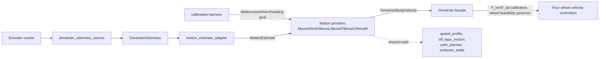

# Motion API System

## 1. Feature Overview

This subsystem sits on top of the drivetrain facade (`DRIVETRAIN_SYSTEM.md`) and
gives a caller distance/point/arc/heading goals instead of raw body velocity:
"go 0.5 m forward," "go to (1.2, 0.4) facing 90°," "turn 45°." It owns six
movement primitives (`MoveS`, `RotS`, `MoveL`, `MoveP`, `MoveC`, `MoveR`), the
shared math they're built from (a jerk-bounded speed ramp, a source-agnostic
lateral PID, line/arc geometry, a shared endpoint-settle hold), the encoder-to-
`MotionEstimate` translation each closed-loop primitive consumes, and the
`calibration` hardware harness that wires all of it onto the real robot for the
first time.

Primary input: a primitive-specific goal (distance+heading, world point+
heading, radius+arc angle, or absolute heading) plus, for every primitive
except `MoveS`/`RotS`, a live `MotionEstimate`. Primary output: one
`DrivetrainBodyVelocity {vx, vy, omega}` per update call, meant to be applied
through `drivetrain_set_advanced_body_velocity()`. Secondary outputs: a status
enum (`RUNNING`/`COMPLETE`/`FAULT`) and primitive-specific progress/error
fields (remaining distance, radial error, heading error, ...).

This is a **library layer, not a scheduler**: every primitive is a plain
`_start()`/`_update()` pair with no timing of its own, matching the pattern
`tape_follower.c` established — compute, don't drive hardware. The only place
in this repo that actually runs one on real hardware today is
`src/harnesses/calibration_main.cpp`; there is no production caller yet.

## 2. System Context



`MoveS`/`RotS` are the one exception to the estimate-in loop: they are
genuinely open-loop (see §5) and take no `MotionEstimate` at all, only `dt_s`.

## 3. Architecture and Layers

### Shared pure math

- `speed_profile.*` — a jerk-bounded speed ramp every primitive's translation
  and/or rotation channel runs through, plus
  `speed_profile_predict_stopping_distance()`, the one-way braking-commitment
  helper described in §5.
- `off_tape_motion.*` — the same generic bounded PID `tape_following_controller`
  uses, reused here with a caller-supplied error source instead of a tape
  sensor (see its own header comment: "off-tape motion has no line-following-
  specific behavior of its own, only a different error source").
- `path_planner.*` — pure geometry: builds a world-frame line from a start
  estimate to a target point (`MoveP`), reports along/cross-track feedback
  against it, and a constant-time angle-wrap helper every primitive with a
  heading uses.
- `endpoint_settle.*` — the shared pulse/pause endpoint-hold controller `MoveC`
  and `MoveP` both call once their one-way speed profile has stopped but a
  small residual error remains below the characterized ~0.05 m/s wheel-
  velocity floor. Extracted 2026-07-22 after being found copy-pasted between
  the two primitives, constants and all.

### Motion primitives

Six primitives split cleanly by two axes: **open- vs. closed-loop**, and
**relative- vs. absolute-target**.

| Primitive | Loop | Target frame | Goal shape |
|---|---|---|---|
| `MoveS` | Open | Relative | distance + body-relative heading |
| `RotS` | Open | Relative | signed angle |
| `MoveL` | Closed | Relative | distance + body-relative heading |
| `MoveC` | Closed | Relative | radius + signed arc angle (tangent = start heading) |
| `MoveP` | Closed | **Absolute** | world (x, y) + absolute final heading |
| `MoveR` | Closed | **Absolute** | absolute world heading |

"Relative" primitives describe *how far to go from here*; the absolute pair
describes *where to end up*, independent of the path taken to get there (see
§5 for why that distinction matters for datum-based navigation). All six
share the config/state split and `esp_err_t` conventions documented in
`TUNING_ROADMAP.md`'s "Context for implementers" section.

### Estimation bridge

- `motion_estimate_adapter.*` — the one-function boundary that turns the
  present millimetre `DrivetrainPose` into the metre-based, world-frame
  `MotionEstimate {x_m, y_m, heading_rad, valid}` every closed-loop primitive
  consumes. A future PMW3610 (optical flow) estimator replaces only this
  boundary, never the primitives themselves.
- `drivetrain_odometry_source.*` — diffs successive `DrivetrainWheelCounts`
  samples into a body-frame delta and feeds `drivetrain_odometry_update()`,
  with no hardware dependency of its own.
- `odometry.*` (declared in the drivetrain-facade layer, reused here) —
  accumulates the cumulative world pose, and now also
  `drivetrain_odometry_set_pose()`, which re-anchors that pose to an arbitrary
  known value; `drivetrain_odometry_reset()` is the `x=y=heading=0` special
  case of it.

### Calibration data and harness

- `move_calibration.h` / `config/drivetrain/move_calibration_config.*` —
  the single measured-factor source of truth (`F_lon`, per-wheel `F_lat`,
  `F_ang`), gated by one `enabled` flag. Applied by the drivetrain facade
  itself (`limit_body_to_wheel_feasibility()` → `F_lon` → per-wheel `F_lat`
  re-clamp), not by any primitive here — the primitives only ever see
  calibration-free body velocity.
- `src/harnesses/calibration_main.cpp` (~1000 lines) — the only production
  wiring of this whole subsystem today: owns one `Drivetrain`, one
  `DrivetrainOdometrySource`, one `DrivetrainOdometry`, and one config +
  runtime-state pair per primitive, all driven from a serial command
  parser. See §6/§7 for its exact command surface.

## 4. Relevant File Map

| File | Role | Why It Exists |
|---|---|---|
| `include/control/drivetrain/speed_profile.h` / `.c` | Jerk-bounded ramp + stopping-distance prediction | Shared by every primitive's translation/rotation channel; the stopping-distance simulation step is clamped (0.02s ceiling) independent of the caller's live `dt_s` — see §11. |
| `include/control/drivetrain/off_tape_motion.h` / `.c` | Source-agnostic lateral PID | Reuses `tape_following_controller`'s bounded PID with a caller-supplied error, not a tape sensor. |
| `include/control/drivetrain/path_planner.h` / `.c` | Line geometry + angle wrap | `MotionEstimate`, `PathPlannerLine`, along/cross-track feedback for `MoveP`; wrap helper used everywhere a heading needs normalizing. |
| `include/control/drivetrain/endpoint_settle.h` / `.c` | Shared pulse/pause endpoint hold | Used by `MoveC`'s radial channel and `MoveP`'s final position hold once their profile has stopped short of tolerance. |
| `include/control/drivetrain/move_s.h` / `.c` | Open-loop straight line | Self-integrates its own commanded speed; never reads odometry. Feeds the `F_lon`/`F_lat` calibration trials. |
| `include/control/drivetrain/rot_s.h` / `.c` | Open-loop in-place rotation | `MoveS`'s rotational counterpart; feeds `F_ang`. |
| `include/control/drivetrain/move_l.h` / `.c` | Closed-loop straight line | Relative distance + body-heading; corrects cross-track via `off_tape_motion`. |
| `include/control/drivetrain/move_p.h` / `.c` | Closed-loop point + heading | Absolute world target; `TRANSLATE_AND_TURN` → `SETTLE_HEADING` → `COMPLETE`. |
| `include/control/drivetrain/move_c.h` / `.c` | Closed-loop circular arc | Relative radius + arc angle; radial correction via `off_tape_motion`, endpoint via `endpoint_settle`. |
| `include/control/drivetrain/move_r.h` / `.c` | Closed-loop in-place rotation | Absolute world heading; the one primitive whose never-started case returns `ESP_ERR_INVALID_ARG`/`FAULT` instead of `ESP_ERR_INVALID_STATE` (§11). |
| `include/control/drivetrain/motion_estimate_adapter.h` / `.c` | Pose-to-estimate boundary | mm `DrivetrainPose` → m `MotionEstimate`; the sole future PMW3610 integration point. |
| `include/control/drivetrain/move_calibration.h`, `config/drivetrain/move_calibration_config.*` | Calibration data contract + measured values | `MoveCalibrationConfig`; applied in the drivetrain facade, not here. |
| `src/harnesses/calibration_main.cpp` | Hardware harness | Wires every primitive onto the real `Drivetrain` facade; owns the serial command surface (§6/§7). |
| `test/test_{move_s,rot_s,move_l,move_p,move_c,move_r,speed_profile,off_tape_motion,path_planner,motion_estimate_adapter,drivetrain_odometry_source}/` | Native coverage | See §14 for what each does and doesn't cover. |
| `tools/calibration_dashboard.html` + `calibration_helper.html` | Trial runner + factor calculator | Web Serial UI for the three-trial-per-direction procedure; computes `F_lon`/`F_lat`/`F_ang` from measured `x_e`/`y_e`/`θ_e`. |
| `tools/jog_program_composer.html` | Jog + program composer + live trajectory | Closed-loop jog nudges (`movel`/`rotl`), a reorderable program of any primitive with in-place-editable steps and export to raw serial commands, and a live SVG actual-vs-commanded trajectory plot. |
| `tools/deprecated/{drive_dashboard,tuning_dashboard,odometry_plotter}.html` | Superseded tools | Kept for reference/offline use; see their in-page banners. |

## 5. Design Intent and Rationale

### Relative primitives are cheap; absolute primitives need a trustworthy estimate

`MoveS`/`RotS`/`MoveL`/`MoveC` describe a delta from wherever the robot
currently is — they need no absolute position bookkeeping, which is exactly
why `MoveS`/`RotS` can be genuinely open-loop (no estimate at all). `MoveP`/
`MoveR` describe a fixed target independent of path, which only pays off if
the `MotionEstimate` feeding them is accurate. The intended pattern (see
`TUNING_ROADMAP.md`'s "harness's `zero`/`setpose` commands" note) is: re-anchor
the world-frame pose at a known physical reference point — a tape datum, or a
marked field start position — then use `MoveP`/`MoveR` for absolute waypoints
within that small local map, rather than trusting one long-lived global map
across an entire course.

### `MoveS`/`RotS` are open-loop on purpose

Both used to read live odometry to decide when to stop. They were made
genuinely open-loop (self-integrating their own commanded speed instead) so
that real mechanical error — wheel slip, radius mismatch, per-wheel response
differences — shows up as *measurable calibration error* instead of being
silently absorbed into the stopping decision. This is what makes them usable
as the calibration trial primitives: the discrepancy between commanded and
measured is the signal the calibration procedure is trying to capture, and a
closed loop would erase it.

### One-way braking commitment, and why its stopping-distance prediction is now clamped

Every primitive with a translation or rotation channel brakes via the same
pattern: once `speed_profile_predict_stopping_distance()` says "start braking
now," that decision is never re-evaluated, or the profile could oscillate
between accelerating and braking forever near the threshold instead of
committing to zero. That prediction runs a bounded internal simulation, and
until 2026-07-23 it used the caller's live per-cycle `dt_s` as that
simulation's step size with no ceiling. On real hardware, one slow control
cycle (a blocking `Serial.print` while streaming telemetry, which happens
almost every cycle) inflated the predicted stopping distance — and because
the decision is one-way, a single glitchy cycle could permanently lock a move
into braking far short of its target. This is what was causing `movel` to
fault on nearly every hardware attempt; the fix clamps the simulation step to
0.02s regardless of the caller's real `dt_s`.

### Endpoint settling exists because of a real wheel-loop deadband

Once a one-way profile has stopped, a small residual error produces a
continuous PID correction below the characterized ~0.05 m/s wheel-velocity
floor — physically inert, so the error would never shrink. `endpoint_settle`
pulses a bounded correction (currently 0.10–0.20 m/s, 0.08s pulse / 0.10s
pause — re-tuned 2026-07-23 after removing wheel-controller duty slew
limiting, which had been capping these pulses at ~0.1 duty against a
~0.25–0.29 feedforward target, likely under real breakaway duty) and pauses
for a fresh estimate, repeated only while still outside tolerance.

### Calibration lives at the facade boundary, not in the primitives

`F_lon`/`F_lat`/`F_ang` are applied once, in `drivetrain.c`, downstream of the
shared wheel-feasibility governor (world-to-body → governor → calibration —
applying calibration first would let it push a command past the ceiling the
governor exists to enforce). Every primitive in this subsystem only ever
requests and receives calibration-free body velocity; none of them know
calibration exists.

## 6. Command Surface (`calibration_main.cpp`)

Typeable any time over serial, one line, newline-terminated:

| Command | Primitive | Frame |
|---|---|---|
| `move <distance_m> <heading_deg> <speed_mps>` | MoveS | relative |
| `rotate <angle_deg> <max_omega_deg_s>` | RotS | relative |
| `movel <distance_m> <heading_deg> <speed_mps>` | MoveL | relative |
| `arc <radius_m> <angle_deg> <speed_mps>` | MoveC | relative |
| `movep <target_x_m> <target_y_m> <final_heading_deg> <speed_mps>` | MoveP | absolute |
| `rotl <target_heading_deg>` | MoveR | absolute |
| `zero` | — | re-anchors world-frame pose to here, as (0,0,0) |
| `setpose <x_m> <y_m> <heading_deg>` | — | `zero`'s general case: re-anchors to any known value |
| `stop` / `brake` / `enable` / `show` | — | lifecycle/status, not a motion |

`zero`/`setpose` and every motion-start command reject while another motion
is active (`use 'stop' first`); `zero`/`setpose` additionally require
`drivetrain_odometry_source_reset()` alongside the pose change itself, or the
next odometry cycle would diff against stale pre-reset counts and instantly
reintroduce the old position.

## 7. Runtime Workflow

1. Harness enables the drivetrain and starts idle (`CalMode::kIdle`).
2. A serial command starts exactly one primitive: its config is validated,
   its runtime state reset, `cal_mode` set to that primitive.
3. Every loop iteration, if a motion is active: the harness reads
   `current_motion_estimate()` (for every primitive except `MoveS`/`RotS`,
   which skip this), calls that primitive's `_update()`, applies the returned
   body velocity through `drivetrain_set_advanced_body_velocity()`, and
   prints telemetry at a fixed period.
4. On `COMPLETE`, the harness prints `# <PRIMITIVE> COMPLETE` and returns to
   idle. On `FAULT` or an update error, it prints `# ... update failed;
   stopping` and calls `stop_motion()` (a controlled zero-velocity command,
   not a hardware brake).

## 8. Data Flow

```
serial command -> primitive _start() -> [primitive _update() loop] -> DrivetrainBodyVelocity
                                              ^                              |
                                MotionEstimate (motion_estimate_adapter)     v
                                              ^                    drivetrain_set_advanced_body_velocity()
                                    DrivetrainOdometry                       |
                                              ^                              v
                                drivetrain_odometry_source        wheel-feasibility governor -> F_lon -> F_lat re-clamp
                                              ^                              |
                                    encoder wheel counts                     v
                                                                    four wheel velocity controllers
```

Telemetry travels the opposite direction, printed by the harness as one CSV
line per period: `millis,mode,pose_x_mm,pose_y_mm,heading_deg,remaining,
vx,vy,omega` — the same format `tools/jog_program_composer.html`'s trajectory
plot and `tools/deprecated/odometry_plotter.html` both parse.

## 9. Control Flow and Scheduling

No primitive schedules itself; the harness's `loop()` calls the active
primitive's `_update()` once per iteration with a measured `dt_s`, gated by
each primitive's own `controller_dt_max_s`/`max_control_dt_s` ceiling (an
oversized `dt_s` faults rather than integrating a stale/oversized step — see
§11 for the one real gap this pattern exposed on hardware). Telemetry prints
at a separate, slower fixed period, independent of the control rate.

## 10. State and Ownership

Each primitive's runtime struct (`MoveS`, `RotS`, `MoveL`, `MoveP`, `MoveC`,
`MoveR`) is a plain value type owned by whatever calls `_start()`/`_update()`
— currently one static instance per primitive inside `calibration_main.cpp`,
matching the "namespace-scope runtime objects in harnesses" convention used
across this repo. None of them retain a hardware handle or talk to the
drivetrain directly; they only ever read a `MotionEstimate` and return a
`DrivetrainBodyVelocity`. `MoveCalibrationConfig` is owned by the drivetrain
facade layer (`DRIVETRAIN_CONFIG.move_calibration`), not by this subsystem.

## 11. Error and Edge-Case Handling

- Every primitive validates its config (`*_config_is_valid()`) and rejects
  non-finite/out-of-range start arguments with `ESP_ERR_INVALID_ARG`.
- A `COMPLETE` output is always an exact-zero body-velocity command, never a
  small residual profile sample — enforced identically across all six.
- An invalid/stale `MotionEstimate` during an active motion faults with an
  exact-zero command rather than requiring the caller to infer "stop now"
  from an error code.
- **Known, deliberately-undocumented-as-fixed inconsistency:** `move_r_update()`
  folds its never-started (`config == NULL`) case into general argument
  validation, returning `ESP_ERR_INVALID_ARG` and marking `MOVE_R_FAULT`,
  where `MoveP`/`MoveC`/`MoveL` check that case separately and return
  `ESP_ERR_INVALID_STATE` without touching status. Covered by
  `test_move_r`'s `test_update_before_start_is_invalid_arg`, which documents
  actual behavior rather than silently "fixing" it — reconciling this is
  still open.
- `speed_profile_predict_stopping_distance()`'s simulation step is clamped to
  0.02s (§5) specifically so a jittery real `dt_s` can't distort the one-way
  braking decision; every native test uses `dt <= 0.02s` so this changed
  nothing for the tested case, only the previously-untested jittery one.

## 12. Integration with the Rest of the Project

The only current integration trace is entirely inside the calibration
harness:

1. `src/harnesses/calibration_main.cpp::setup` — initializes `Drivetrain`,
   `DrivetrainOdometrySource`, `DrivetrainOdometry`.
2. A serial command reaches one of `start_move`/`start_rotate`/`start_movel`/
   `start_movep`/`start_arc`/`start_mover`.
3. `calibration_main.cpp::loop` — services whichever primitive is active,
   feeding it a fresh `MotionEstimate` and applying its output.
4. `tools/calibration_dashboard.html` or `tools/jog_program_composer.html`
   over Web Serial, driving the same command surface from a browser.

There is no production caller: like the drivetrain facade itself, this
subsystem is fully implemented and unit-tested but not yet wired into a
default/production firmware entry point (`src/main.cpp` remains the same
two-motor bench program `DRIVETRAIN_SYSTEM.md` describes).

## 13. Extension Points

- **Production integration**: a real caller (tape-following handoff, an
  autonomous routine) would drive these primitives the same way
  `calibration_main.cpp` does — read `MotionEstimate`, call `_update()`,
  apply the result through `drivetrain_set_advanced_body_velocity()`.
- **PMW3610 optical-flow estimator**: replaces only `motion_estimate_adapter`'s
  input source; no primitive changes.
- **Reconciling MoveR's error-code inconsistency** (§11) with its siblings.
- **Physical MoveC/MoveP validation, reverse-duty symmetry sweep, and
  re-validating `F_lon`/`F_lat`/`F_ang`** against the current code — all still
  open per `TUNING_ROADMAP.md`'s "suggested next steps."
- **Datum-based navigation**: `zero`/`setpose` already provide the re-
  anchoring primitive; a higher-level routine that detects a physical datum
  (e.g. a tape marker) and calls `setpose` automatically would close the loop
  described in §5.

## 14. Current Limitations and Missing Components

### Confirmed Gaps

1. No production caller — this subsystem is only exercised through the
   calibration harness and its browser tools.
2. `MoveR`'s never-started error-code path differs from its siblings (§11).
3. `MoveC` (`arc`) and `MoveP` (`movep`) have not yet been run on real
   hardware this validation pass — `MoveS`, `MoveL`, `RotS`, and `MoveR` have.
4. Reverse-direction duty symmetry and re-validating `F_lon`/`F_lat`/`F_ang`
   against the current (post-fix) code are still outstanding.

### Native Test Coverage

| Module | Covers |
|---|---|
| `test_speed_profile` | Ramp convergence, jerk/accel limits, overshoot clamping, config validation. |
| `test_off_tape_motion` | Error-to-correction mapping, saturation, long-`dt` integral capping, reset. |
| `test_path_planner` | Line construction, along/cross-track feedback, angle-wrap boundedness. |
| `test_motion_estimate_adapter` | mm→m conversion, invalid-estimate rejection. |
| `test_drivetrain_odometry_source` | Wheel-count diffing into body deltas, baseline reset. |
| `test_move_s` / `test_rot_s` | Self-integrated progress, one-way braking, irregular-`dt` overshoot guard, exact-zero completion. |
| `test_move_l` | Cross-track correction, body-heading rotation, invalid-feedback faulting. |
| `test_move_p` | Translate-and-turn start, exact-zero completion, invalid-estimate faulting. |
| `test_move_c` | Radial correction sign (both turn directions), stalled-progress faulting, endpoint pulse-above-deadband. |
| `test_move_r` | Config validation (incl. `controller_dt_max_s`), sign/wrap across the ±π seam, dt-fault path, simulated convergence, the documented error-code inconsistency. |

## 15. Example Runtime Sequence

1. Operator connects `tools/calibration_dashboard.html`, sends `enable`.
2. Operator sends `setpose 0 0 0` at a marked start position (or `zero` if
   the robot is already there).
3. Operator sends `movep 1.2 0.4 90 0.2` — `MoveP` starts, translating and
   turning toward the absolute target.
4. Harness prints CSV telemetry each period; `tools/jog_program_composer.html`
   (if connected instead) plots actual vs. commanded position live.
5. `MoveP` reaches `SETTLE_HEADING`, holds the final position via
   `endpoint_settle` until within tolerance, prints `# MOVEP COMPLETE`.
6. Operator sends `stop`/`brake`, or the next command.

## 16. Developer Reading Order

1. `include/control/drivetrain/speed_profile.h`, then `path_planner.h` —
   the two smallest shared pieces every primitive builds on.
2. `include/control/drivetrain/off_tape_motion.h` — read alongside
   `control/tape_following/tape_following_controller.h` to see the reuse.
3. `include/control/drivetrain/move_s.h`/`rot_s.h`, then their `.c` — the
   simplest primitives (open-loop, self-integrated); establishes the one-way
   braking pattern every other primitive repeats.
4. `include/control/drivetrain/move_l.h`/`.c` — the simplest closed-loop
   primitive (relative, translation-only).
5. `include/control/drivetrain/endpoint_settle.h`/`.c`, then `move_c.h`/`.c`
   and `move_p.h`/`.c` — the two primitives that share it.
6. `include/control/drivetrain/move_r.h`/`.c` — the absolute-heading
   primitive, and its documented error-code inconsistency (§11).
7. `include/control/drivetrain/motion_estimate_adapter.h` — the estimation
   boundary every closed-loop primitive above depends on.
8. `src/harnesses/calibration_main.cpp` — read last; it's where every piece
   above actually gets wired onto real hardware, and defines the full serial
   command surface (§6).
9. `docs/TUNING_ROADMAP.md` — the working roadmap/changelog this doc
   summarizes into a stable architecture reference; check it for anything
   more recent than this doc's own validation snapshot below.

## Validation Snapshot

Validated on 2026-07-23:

- Native tests: 111/111 passed, across every module listed in §14 plus the
  drivetrain-facade suites `DRIVETRAIN_SYSTEM.md` already covers.
- Firmware builds: `calibration`, `drive`, and `drivetrain-test` all
  succeeded.
- Hardware: `MoveS` (`move`), `MoveL` (`movel`), `RotS` (`rotate`), and
  `MoveR` (`rotl`) have been run to completion on the real robot this pass,
  including diagnosing and fixing two real bugs surfaced only by hardware
  timing (the stopping-distance `dt` sensitivity and the duty-slew limit —
  both in §5/§11). `MoveC`/`MoveP` have not yet had a hardware pass.
