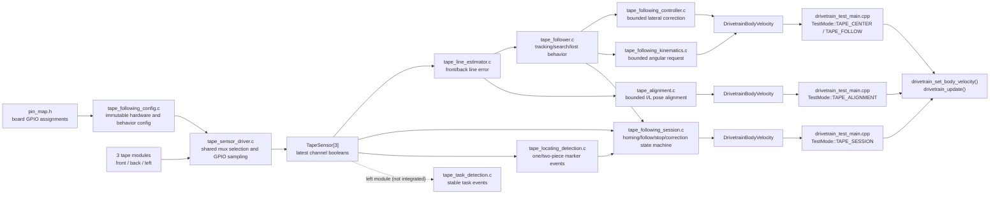

# Tape Following System

## 1. Feature Overview

The tape-following subsystem reads three four-channel tape modules through a shared two-bit multiplexer address, interprets the front or back module as a lateral line position, and computes a bounded drivetrain body-velocity request. The front module guides forward travel, the back module guides reverse travel, and the left module is intended to detect broad task markers.

The implementation is split into board configuration, GPIO sampling, hardware-independent sensing, control mathematics, a stateful follower, a session/alignment layer built on top of the follower, and application/drivetrain integration. The pure sensing and control pieces are implemented and covered by native tests. Physical sampling and end-to-end motion are exercised only by the `drivetrain-test` diagnostic firmware.

There is no production tape-following application or robot/course state machine in this repository. The default `src/main.cpp` is a two-motor duty bench test and does not initialize the mux, tape modules, `TapeFollower`, `TapeFollowingSession`, `TapeTaskDetector`, or `Drivetrain`. The left-module task detector is configured and unit-tested but is not used by the diagnostic harness either. Everything described in this document, including the newer session/alignment/locating layer, is reachable only through the `drivetrain-test` serial command surface (see §4a "Usage: diagnostic serial commands").

Primary inputs are the three module GPIO levels, requested signed longitudinal velocity, elapsed update time, and immutable tuning/configuration. The follower's primary output is a `DrivetrainBodyVelocity` plus `motion_valid`, line error, and follower status. The session layer wraps that output with distance/marker stop conditions, an end-of-run lateral correction, and optional homing. Only the diagnostic harness currently forwards any of this output to the drivetrain.

## 2. System Context

`src/harnesses/drivetrain_test_main.cpp` is the only application entry point that initializes and samples physical tape hardware. It polls all modules every 5 ms and runs its motion-control path on a nominal 5 ms period. Serial commands select monitoring, stationary centering, forward/reverse following, bounded pose alignment, or a full session run (optional homing, travel to a distance or locating marker, controlled stop, and end correction). `tools/drivetrain_test_dashboard.html` is an operator UI, but it currently only wires up `tape-center` and `tape-follow`; `tape-align` and `tape-session` must be typed into the harness's serial console directly (see §4a).

The subsystem depends on ESP-IDF GPIO and microsecond-delay APIs at the driver boundary. Above that boundary, the estimator, task detector, controller, kinematics, and follower operate on C structs and are host-testable.

## 3. Architecture and Layers

### Board and behavior configuration

`include/config/pin_map.h` names physical GPIOs. `include/config/tape_following/tape_following_config.h` and `src/config/tape_following/tape_following_config.c` bind those pins to driver configuration and define estimator weights, PID limits, heading mapping, search behavior, and task debounce thresholds. These files produce immutable `const` objects; they do not sample hardware or own update history.

### Tape hardware driver

`include/drivers/tape_sensor/tape_sensor_driver.h` and `src/drivers/tape_sensor/tape_sensor_driver.c` configure selector/output pins, drive mux addresses, wait for settling, read digital levels, store the latest four booleans per module, and optionally pack each module into a nibble. This layer owns electrical facts such as active-high detection and the 5 us settling delay. It must not decide which physical module leads, what a channel pattern means for steering, whether a task exists, or what the motors should do.

The mux and per-module sensor are separate concepts but are implemented in the same header/source pair. `TapeSensorMux` represents the two selector GPIOs shared by all modules. Each `TapeSensor` represents one module output GPIO and points to the shared mux. This avoids configuring or ambiguously owning the same selector pins three times while retaining distinct sample state for front, back, and left modules.

### Hardware-independent sensing

`tape_line_estimator.*` converts four sampled booleans into a weighted centroid and remembers the last known side for lost-line recovery. `tape_task_detection.*` counts active channels on the left module and debounces a broad observation into stable level and edge events. Neither module performs GPIO operations.

### Control mathematics

`tape_following_controller.*` implements bounded PID lateral correction. `tape_following_kinematics.*` maps longitudinal/lateral velocity into a direction-aware, rate-limited angular velocity. Both are intended to remain independent of application state, sensor selection, GPIO, and drivetrain calls.

### Stateful tape-following behavior

`tape_follower.*` selects the front or back sensor from travel direction, coordinates estimation, PID, heading mapping, direction changes, and short lost-line search, and emits a drivetrain-compatible request. Sensor polling remains outside it, and it never calls the drivetrain directly.

### Application and drivetrain integration

The diagnostic harness owns scheduling, commands, mode transitions, live tuning copies, failure response, and the decision to apply or suppress follower output. Tape center/follow tests accept durations up to 60 seconds; other timed diagnostic motions retain their 10-second limit. The drivetrain facade validates the resulting body command, refreshes its watchdog, converts body velocity to wheel targets, updates encoders and wheel PI controllers, and applies motor duties. These application and drivetrain responsibilities do not belong in the tape hardware driver or pure follower.

## 4. Relevant File Map

| File | Role | Why It Exists |
|---|---|---|
| `include/config/pin_map.h` | Board hardware configuration | Defines the three tape input GPIOs and two shared channel-select GPIOs. |
| `include/config/tape_following/tape_following_config.h` | Configuration interface | Exposes named immutable mux, module, estimator, follower, and task-detector configurations. |
| `src/config/tape_following/tape_following_config.c` | Configuration composition | Binds board pins and supplies current weights, controller limits, heading/search tuning, and debounce counts. |
| `include/drivers/tape_sensor/tape_sensor_driver.h` | Tape hardware API and state types | Declares mux/module configuration, runtime sampled state, initialization, scan, and packed-read APIs. |
| `src/drivers/tape_sensor/tape_sensor_driver.c` | Tape hardware implementation | Owns GPIO setup, channel address selection, settling delay, active-level interpretation, sampling, and packing. |
| `include/sensing/tape_following/tape_line_estimator.h` | Line-estimation API | Separates channel geometry/configuration from mutable line-history state. |
| `src/sensing/tape_following/tape_line_estimator.c` | Line interpretation | Computes the active-channel weighted centroid and lost-line fallback direction. |
| `include/sensing/tape_following/tape_task_detection.h` | Task-detector API/state | Defines debounce configuration, mutable detector state, and transition output intended for a robot manager. |
| `src/sensing/tape_following/tape_task_detection.c` | Task-marker interpretation | Counts active left-module channels and debounces detection start/end. |
| `include/control/tape_following/tape_following_controller.h` | PID API/state | Defines immutable gains/limits separately from integral and derivative history. |
| `src/control/tape_following/tape_following_controller.c` | Lateral control math | Computes and clamps PID lateral correction. |
| `include/control/tape_following/tape_following_kinematics.h` | Heading-map API | Defines stateless velocity-to-angular-velocity configuration and conversion. |
| `src/control/tape_following/tape_following_kinematics.c` | Heading control math | Applies travel-direction polarity, angular limits, and angular acceleration limits. |
| `include/control/tape_following/tape_follower.h` | Follower public contract | Defines follower configuration, input/output, status, and retained runtime history. |
| `src/control/tape_following/tape_follower.c` | Tape behavior coordinator | Selects the leading sensor and coordinates tracking, searching, lost, idle, and direction-change behavior. |
| `include/sensing/tape_following/tape_locating_detection.h` | Locating-marker API/state | Defines one/two-piece marker detection config, debounce/progress state, and event output for a chosen locating sensor. |
| `src/sensing/tape_following/tape_locating_detection.c` | Locating-marker interpretation | Debounces active-channel runs on the configured side sensor into single/double marker events with along-tape center progress. |
| `include/control/tape_following/tape_following_session.h` | Session public contract | Defines the homing/following/stop/end-correction/complete/timeout/fault state machine built on `TapeFollower`. |
| `src/control/tape_following/tape_following_session.c` | Session state machine | Runs optional homing, hands off to the follower, watches for a distance or locating-marker stop condition, then runs a bounded end-of-run lateral correction. |
| `include/config/tape_following/tape_following_session_config.h` | Session production defaults | Exposes `TAPE_FOLLOWING_SESSION_CONFIG`, the stop/correction/locating-geometry tuning ported from the harness's `start_tape_session()`. |
| `src/config/tape_following/tape_following_session_config.c` | Session default composition | Defines `TAPE_FOLLOWING_SESSION_CONFIG`; per-invocation fields (direction/speed/distance/marker) are left for a future caller to set. |
| `include/control/tape_following/tape_alignment.h` | Alignment public contract | Defines bounded, non-oscillating pose-alignment config/state for the "I" (longitudinal) and "L" (`PY`+`MX`) modes. |
| `src/control/tape_following/tape_alignment.c` | Alignment state machine | Drives front/back (and side, for L-mode) line error to zero within tolerance, with settle-sample confirmation and a timeout/fault path. |
| `include/control/drivetrain/x_drive_kinematics.h` | Shared command type | Declares `DrivetrainBodyVelocity`, the follower/session/alignment/drivetrain integration contract. |
| `include/control/drivetrain/drivetrain.h` | Drivetrain facade API | Accepts bounded body commands and exposes drivetrain lifecycle/update operations. |
| `src/control/drivetrain/drivetrain.c` | Drivetrain command consumer | Converts accepted follower commands into closed-loop wheel duties and enforces timeout/error safety. |
| `include/config/drivetrain/drivetrain_config.h` | Drivetrain configuration interface | Exposes the hardware and motion limits used by the diagnostic integration. |
| `src/config/drivetrain/drivetrain_config.c` | Drivetrain composition | Supplies the body-velocity bounds against which harness commands are checked. |
| `src/harnesses/drivetrain_test_main.cpp` | Current hardware/application integration | Initializes sensors and drivetrain, polls tape, implements `TestMode`, runs center/follow/align/session commands, and publishes telemetry. |
| `tools/drivetrain_test_dashboard.html` | Diagnostic operator UI | Sends `tape-center`/`tape-follow` commands and tuning, and renders front/back/left bit patterns and correction telemetry. Does not yet expose `tape-align` or `tape-session`. |
| `test/test_tape_following/test_tape_following.cpp` | Native unit tests | Tests estimator, PID, heading mapping, directional follower behavior, search/lost transitions, and task debounce without GPIO. |
| `test/native_stubs/driver/gpio.h` | Native test type stub | Supplies `gpio_num_t` so sampled tape structs compile on the host. |
| `test/native_stubs/esp_err.h` | Native error stub | Supplies the ESP error types/constants used by pure modules. |
| `test/native_stubs/robot_common/math_utils.h` | Native math stub | Supplies `clamp()` used by the tape PID implementation. |
| `platformio.ini` | Build integration | Selects tape pure modules for native tests and all required tape/drivetrain sources for `drivetrain-test`. |
| `src/main.cpp` | Default application entry point | Establishes that tape following is absent from the default firmware; it currently runs a motor bench test. |

### Usage: diagnostic serial commands

All tape behavior is driven through the `drivetrain-test` firmware's newline-terminated serial console (115200 baud). There is no other entry point today. `help` prints the full command list from `print_help()`; the tape-relevant subset is:

| Command | Purpose | Underlying layer |
|---|---|---|
| `tape` / `tape-center front\|back [max_mps] [ms] [polarity]` | Stationary lateral centering on one sensor; `vx`/`omega` stay zero. | Harness-local estimator+PID path, bypasses `TapeFollower`. |
| `tape-follow front\|back [travel_mps] [max_strafe_mps] [ms] [polarity]` | Timed forward/reverse following with no stop/marker/homing logic. | `tape_follower_update()` directly (`TestMode::TAPE_CENTER`, `tape_follow_velocity_mps != 0`). |
| `tape-align i\|l [timeout_ms]` | Bounded, non-oscillating pose alignment: `i` zeroes front/back longitudinal error, `l` aligns `PY`+`MX` including a side sensor. | `tape_alignment_*()` (`TestMode::TAPE_ALIGNMENT`). |
| `tape-session px\|mx\|py cw\|ccw none\|one\|two [distance_m] [speed_mps] [timeout_ms]` | One full run: optional homing, follow in `direction`, stop at `distance_m` and/or a `one`/`two`-piece locating marker on the `cw`/`ccw` side sensor, controlled stop, then end-of-run correction back onto the marker. | `tape_following_session_*()` (`TestMode::TAPE_SESSION`). |

Notes for `tape-session`, since it is the newest and least discoverable path:

- At least one of `distance_m > 0` or a marker other than `none` is required — the harness rejects `tape-session px cw none` outright.
- `speed_mps` is clamped to `test_config.max_vx_mps`; `timeout_ms` is clamped to `kMaxTapeDurationMs` (60 s), same as the other timed tape commands.
- The per-invocation `direction`/`locating_side`/`speed`/`distance`/`marker`/`timeout` come from the command line; the remaining tuning (`stop_settle_time_s`, `correction_speed_mps`, `correction_tolerance_m`, `correction_max_distance_m`, locating-detector geometry) is hardcoded in `start_tape_session()` in `drivetrain_test_main.cpp`, not read from `TAPE_FOLLOWING_SESSION_CONFIG` in `tape_following_session_config.c`. `home_before_following` is always left `false` from this command; there is currently no serial flag to request homing.
- `TapeFollowingSessionStatus` (`idle`/`homing`/`following`/`controlled-stop`/`end-correction`/`complete-distance`/`complete-locating`/`timeout`/`tape-lost`/`fault`/`stopped`) is reported in status telemetry via `tape_session_status_name()`, alongside `progress_m` and the detected `locating_marker`.
- `tape-session` requires `tape_sensors_ready`; like the other tape commands it coasts the drivetrain before starting and stops automatically at a terminal status (`tape_session_is_terminal()`).

`tools/drivetrain_test_dashboard.html` only has buttons/fields for `tape-center` and `tape-follow` (`followTape()`, the `#tapeCenter` handler). `tape-align` and `tape-session` must be typed directly into a serial terminal; they are not reachable from the dashboard yet.

### Configuration files

The board pin map should change for wiring or board revisions. Tape configuration should change for module assignments, channel geometry, gains, limits, search settings, or debounce thresholds. Mutable readings, counters, controller history, and application modes should remain outside both.

The front module is mounted with mux channels reversed across the robot, so its channel-index weights are `{3, 1, -1, -3}`; the back module uses `{-3, -1, 1, 3}`. In both cases, a physical observation from left to right produces errors from -3 through +3. The controller starts as proportional-only (`Kp = 0.10`) with lateral correction bounded to ±0.30 m/s. Comments explicitly call these values conservative and require polarity verification and low-speed tuning on the assembled robot.

### Hardware driver files

`TapeSensorMuxConfig` contains only selector pins; `TapeSensorMux` adds the retained configuration pointer and `initialized` flag. `TapeSensorDriverConfig` contains one module output pin; `TapeSensor` adds a mux pointer and four mutable channel booleans. `tape_sensor_driver_read_all()` updates the booleans, while `tape_sensor_driver_read_all_raw()` performs the same scan and additionally packs bits 0–3.

Mux channel selection is a private helper because callers should request a scan rather than manipulate shared selector pins. Conversely, line weights, PID, task rules, and travel direction belong above the driver because they describe meaning and behavior rather than electrical access.

### Sensing and control files

The line estimator owns interpretation of an already sampled module. The task detector owns debounced semantic events from the left module. PID owns controller history and correction math. Heading kinematics owns the mapping from the translation vector to angular motion. `TapeFollower` is the behavior coordinator and owns the histories that cross updates.

`TapeLineEstimatorState.last_known_error` is used for follower search direction. `TapeFollowerStatus` is returned per update; it is not itself an application state machine and is not retained as a status field in `TapeFollower`.

### Session, alignment, and locating files

`TapeFollowingSession` is a state machine layered on top of `TapeFollower`, not a replacement for it: it owns one `TapeFollower` instance plus one `TapeLocatingDetector`, and its `tape_following_session_update()` delegates line-tracking to `tape_follower_update()` while adding what the follower deliberately does not do — optional wiggle-based homing before following starts, a distance and/or locating-marker stop condition, a settle-timed controlled stop, and a bounded end-of-run lateral correction back onto the detected marker. `TapeFollowingSessionStatus` (see the usage table above) is the closest thing this repository has to a course/task state machine, but it is still scoped to one session run, not a persistent robot manager.

`TapeAlignment` is independent of both `TapeFollower` and `TapeFollowingSession`. It drives estimator error on one or two sensors to zero within tolerance for `settle_samples` consecutive updates, then reports `TAPE_ALIGNMENT_COMPLETE`; it never calls the follower and has no locating/session awareness. `TapeLocatingDetector` is a pure debounce/geometry module — it turns one sensor's active-channel run into `TAPE_LOCATING_MARKER_SINGLE`/`_DOUBLE` events with an along-tape center position — that only the session currently consumes.

### Application and test files

The harness maintains stable storage for configuration copies and runtime objects, samples at 5 ms, and runs its drivetrain control block at 5,000 us. `TestMode::TAPE_CENTER` is used for both stationary centering and moving tape following; `tape_follow_velocity_mps == 0` distinguishes them. `TestMode::TAPE_ALIGNMENT` and `TestMode::TAPE_SESSION` are separate modes for `tape-align` and `tape-session`. This naming is diagnostic-harness behavior, not a reusable tape-layer state model.

The native tests construct `TapeSensor` values directly and therefore validate interpretation/control but not GPIO configuration, mux sequencing, settling, bit packing, actual timing, harness transitions, or drivetrain effects. `platformio.ini` deliberately excludes the hardware driver from the native build.

## 5. Design Intent and Rationale

### Shared mux versus individual tape modules

**Documented intent:** Driver comments and `FILE_RESPONSIBILITIES.md` state that three tape modules share two selector pins while each has one selected-channel input. The driver therefore exposes one `TapeSensorMux` plus three `TapeSensor` instances.

This division gives the shared selector resource one configuration/initialization owner and gives each physical module separate input wiring and sample storage. It also allows every selected channel to be read from all three modules before advancing the mux. The cost is that a full-scan API is specialized to exactly three modules and requires callers to preserve a valid shared mux object.

The phrase “multiplexer driver and tape sensor driver” should not be read as two source modules in the current repository. Mux and module lifecycle functions are separate public responsibilities inside the same `tape_sensor_driver.*` module. This is consistent at initialization, but the scan function does not verify that all three sensors point to the same mux; it selects only `sensors[0]->mux`.

### Immutable configuration versus mutable runtime state

**Documented intent:** `PROJECT_STRUCTURE.md`, `FILE_RESPONSIBILITIES.md`, public comments, and the `const` definitions explicitly separate board/tuning configuration from live samples and history.

Examples include `TapeSensorMuxConfig` versus `TapeSensorMux`, `TapeSensorDriverConfig` versus `TapeSensor`, `TapeLineEstimatorConfig` versus `TapeLineEstimatorState`, `TapeFollowingControllerConfig` versus `TapeFollowingControllerState`, and `TapeFollowerConfig` versus `TapeFollower`. This keeps reusable algorithms independent from this board's pin assignments and tuning, permits several runtime instances to share immutable configuration, and lets tests supply local configurations without hardware.

The tradeoff is pointer lifetime: initialized runtime objects retain pointers rather than copying most configuration. The caller must keep every referenced config alive and unchanged for the runtime object's lifetime. Global `const` production objects satisfy this. The harness also uses namespace-scope RAM copies, so its pointers remain valid.

### Hardware driver versus tape-following behavior

**Documented intent:** Headers and repository architecture documentation consistently assign GPIO, active level, mux addressing, settling, and raw samples to the driver; channel meaning and behavioral decisions are assigned above it.

The boundary improves host testability and keeps changing a controller gain or lost-line policy from altering hardware code. The implementation follows it: `TapeFollower` consumes already sampled `TapeSensor` objects, selects front/back from signed travel velocity, and emits a command without GPIO or drivetrain calls. The driver contains no estimator weights or motor decisions.

### Follower output versus drivetrain ownership

**Documented intent:** `TapeFollowerOutput.requested_velocity` is explicitly compatible with `drivetrain_set_body_velocity()`, but the header instructs callers to apply it only when `motion_valid` is true. `tape_follower_update()` explicitly never commands the drivetrain.

This makes the application/state-machine layer the safety and arbitration owner. It can decide whether tape following is active, whether another behavior wins, and what to do on `SEARCHING` or `LOST`. The diagnostic harness follows this contract by zeroing commands when output is invalid, then passing valid/ramped values through the drivetrain facade. No production owner currently exists.

### Direction-specific sensing and recovery

**Documented intent:** Positive travel selects the front sensor; negative travel selects the back. Controller history is reset across direction changes, and acquired/search history is separate per sensor so front history cannot drive reverse recovery.

This supports bidirectional motion without mixing physically different sensor histories. When tape disappears after acquisition, the follower turns in place toward `last_known_error` for up to the configured timeout. Turn polarity is mirrored for reverse travel so the back of the robot turns toward the side observed by the back sensor.

### Scheduling and blocking

**Documented intent:** Sensor sampling remains outside `TapeFollower` for GPIO independence and testability. The harness schedules it separately from follower/drivetrain control.

The driver scan is synchronous and blocking: it selects four channels, waits 5 us after each selection, and reads three GPIOs for each channel. No interrupt, task, lock, or asynchronous completion mechanism exists. This is simple, but the shared selector means concurrent scans or independent channel manipulation would race. The current single-threaded Arduino loop avoids that problem.

### Task detection and state-machine events

**Documented intent:** The task detector header says its stable level and one-update start/end events are for `RobotManager`.

No `RobotManager` implementation or call site exists in this repository. Therefore the event shape documents a planned boundary, while actual task-driven state transitions are missing. The diagnostic `TestMode` state machine does not initialize or update `TapeTaskDetector`.

### Apparent architectural goals

The documented architecture aims to keep board wiring immutable, direct hardware access contained, sensing and control host-testable, behavior state explicit and instance-owned, and final motion authority in an application layer above the follower. The component boundaries largely implement those goals, but production composition, task-event consumption, driver-level tests, and ownership of the overall course state machine remain absent.

## 6. Initialization Workflow

The only complete hardware initialization sequence is in the `drivetrain-test` environment:

1. Arduino calls `setup()` in `src/harnesses/drivetrain_test_main.cpp`.
2. `initialize_test_config()` copies `DRIVETRAIN_CONFIG` and `TAPE_FOLLOWER_CONFIG` into namespace-scope mutable diagnostic configurations. Motor/encoder configs are also copied for RAM-only inversion tests.
3. `initialize_tape_sensors()` calls `tape_sensor_mux_init(&tape_sensor_mux, &TAPE_SENSOR_MUX_CONFIG)` before any module initialization.
4. `tape_sensor_mux_init()` stores the config pointer, configures both selector GPIOs as outputs, selects channel 0, waits 5 us, and marks the mux initialized. A repeated call on an initialized object returns `ESP_OK` without applying a new config.
5. The harness initializes front, back, then left `TapeSensor` objects with their individual configs and the shared mux. Each call clears four samples and configures its module pin as a floating digital input.
6. If any tape initialization fails, the harness sets `tape_sensors_ready = false`, reports the error, and returns. It performs no rollback of previously initialized tape GPIOs.
7. On success, the harness marks the sensors ready and immediately performs one full scan.
8. Independently, the harness initializes and enables `Drivetrain`. Tape initialization failure does not prevent drivetrain initialization; tape commands remain unavailable.
9. `TapeFollower` is not initialized at startup. `start_tape_center()` creates and initializes it only when a moving `tape-follow` command begins. Stationary `tape-center` uses separate estimator/controller state instead.
10. `TapeTaskDetector` is never created or initialized in an application.

Both mux and follower initialization expect zero-initialized runtime objects. `TapeSensorMux` uses `initialized` to detect repeat initialization; `TapeFollower` uses non-null `config`. The task detector explicitly has an `initialized` flag. `TapeSensor` has no explicit initialized flag.

The mux stores its configuration before GPIO setup but does not mark itself initialized until setup succeeds. A tape module now publishes its config/mux pointers only after its input GPIO setup succeeds, so null module pointers reliably represent unsuccessful initialization. There is still no deinitialization API for rolling hardware back after a later module fails.

## 7. Runtime Workflow

### Complete sensor-read cycle

1. The harness calls `sample_tape_sensors()` every time at least `kTapeSamplePeriodMs` (5 ms) has elapsed, or immediately for the serial `tape` command.
2. It calls `tape_sensor_driver_read_all_raw()` with an ordered pointer array: front, back, left.
3. `tape_sensor_driver_read_all()` validates that all three entries, configs, mux pointers, and mux configurations exist and that each mux reports initialized.
4. For channel 0, the private selector drives A low/B low, then blocks for 5 us.
5. While that channel is selected, the driver reads the front, back, and left output GPIOs. A high level means tape. It stores each result in that module's `channel_0`.
6. The driver repeats for channel 1 (A high/B low), channel 2 (A low/B high), and channel 3 (A high/B high), with the same settle-and-read sequence.
7. The raw wrapper packs each module's `channel_0` through `channel_3` into bits 0 through 3 of `tape_bits[module]`. The diagnostic telemetry reverses the front module's display string so every module is shown in physical left-to-right order.
8. The mux remains set to channel 3 after the scan. No timestamp or scan-valid generation is stored with the samples.
9. If the scan succeeds, later control code reads the updated `TapeSensor` booleans. If it fails, the harness permanently clears `tape_sensors_ready`; during active tape mode it begins a controlled drivetrain stop.

Because the modules share selection lines, the implementation samples all three outputs for each selected channel rather than scanning one complete module at a time. A scan therefore represents four sequential channel instants, not one atomic simultaneous 12-bit capture.

### Tracking

At each diagnostic control cycle in tape-follow mode, `service_tape_center()` constructs `TapeFollowerInput` from front/back samples and signed travel velocity. `tape_follower_update()` selects the leading sensor, computes weighted error, caps controller `dt` after a stall, obtains bounded `vy`, computes rate-limited `omega`, and returns `{vx, vy, omega}` with `TRACKING` and `motion_valid = true`.

The harness copies that request into command fields, applies its translation ramp (but deliberately does not re-ramp follower-produced omega), then calls `drivetrain_set_body_velocity()` and `drivetrain_update()`.

### Searching, lost, idle, and alternative centering

If a previously acquired line vanishes, the follower resets steering history and commands an in-place turn toward the last known side at 0.40 rad/s. `motion_valid` is true only when that side and the configured turn rate are nonzero. Once elapsed loss reaches `search.timeout_s` (currently 4.0 s), status becomes `LOST` and motion is invalid. Missing tape before first acquisition goes directly to `LOST`.

The harness handles all invalid follower output by immediately zeroing command and applied velocities. It does not change out of `TestMode::TAPE_CENTER`; the timed test remains active until its duration expires or another failure/command changes mode. A zero travel request makes the reusable follower `IDLE`, but the harness does not use the follower for stationary centering.

Stationary `tape-center` is a parallel harness-local path: it calls the estimator and PID directly, fixes `vx` and `omega` at zero, and sets lateral correction only while tape is present. This bypasses `TapeFollower` search/status/heading behavior by design of the diagnostic command, but duplicates orchestration that otherwise belongs to the follower layer.

## 8. Data Flow

`Tape module photodetector levels → shared mux/GPIO driver → TapeSensor booleans → line estimator → TapeFollower → PID + heading kinematics → TapeFollowerOutput → diagnostic mode/ramp → Drivetrain → wheel targets/PI → motor duties`

The left-module branch is currently only:

`Left TapeSensor booleans → telemetry`

The implemented but unintegrated intended branch is:

`Left TapeSensor booleans → TapeTaskDetector → TapeTaskDetectionOutput → no current consumer`

### Important data ownership

| Data | Declared in | Owner/creator | Readers and writers | Lifetime/passing |
|---|---|---|---|---|
| `TAPE_SENSOR_MUX_CONFIG` and module configs | `tape_following_config.h` | Global `const` definitions in `tape_following_config.c` | Driver reads; nobody mutates | Static lifetime; retained by pointer. |
| `TapeSensorMux` | `tape_sensor_driver.h` | Diagnostic harness | Driver initializes/reads it; sensors retain pointer | Namespace-scope runtime object. |
| `TapeSensor[3]` | `tape_sensor_driver.h` | Diagnostic harness | Driver writes samples; estimator/follower/telemetry read | Namespace-scope runtime array; passed by pointer. |
| Estimator configs | `tape_line_estimator.h` | Global config; harness also makes polarity-adjusted copies | Estimator reads; harness mutates only its copies before follower init | Static/namespace lifetime; retained through follower config pointers. |
| `TapeLineEstimatorState` | `tape_line_estimator.h` | `TapeFollower`, plus one harness-local center state | Estimator writes; follower reads last error | Stored by value inside owning runtime object. |
| `TapeFollowingControllerState` | `tape_following_controller.h` | `TapeFollower`, plus one harness-local center state | PID update/reset mutates | Stored by value. |
| `TapeFollowerConfig` | `tape_follower.h` | Global const; harness makes live and per-run copies | Follower validates and retains pointer | Must outlive follower. |
| `TapeFollower` | `tape_follower.h` | Diagnostic harness | Harness initializes/updates; component functions mutate history | Namespace-scope runtime object, cleared per follow start. |
| `TapeFollowerOutput` | `tape_follower.h` | Stack-local per control update | Follower fills; harness reads | Passed by output pointer; one-cycle lifetime. |
| `TapeTaskDetector` / output | `tape_task_detection.h` | Tests only | Detector functions mutate/read | No application lifetime exists. |
| `DrivetrainBodyVelocity` | `x_drive_kinematics.h` | Follower output then harness command | Follower produces; drivetrain copies values | Passed by value within output, then as three scalars to drivetrain. |

## 9. Control Flow and Scheduling

The diagnostic firmware uses Arduino's single-threaded `setup()`/`loop()` model. `setup()` runs initialization once. `loop()` handles serial input, polls tape at a 5 ms minimum interval, evaluates `TestMode` transitions, and runs closed-loop control when at least 5,000 us has elapsed.

Tape sampling and control are independently time-gated within the same loop. A control update uses the most recently completed scan; it does not demand a new scan or check sample age. Serial handling and other loop work can delay either operation. No frequency is specified for a future production application.

`TestMode` is the current application-level diagnostic state machine. Commands enter `TAPE_CENTER`; timeout enters `STOPPING`; stopped wheels or stop deadline enter `IDLE`. Operator commands and reported errors can also change mode. `TapeFollowerStatus` independently reports `IDLE`, `TRACKING`, `SEARCHING`, or `LOST` for one follower update, but those statuses do not drive harness mode transitions.

The 5 us mux settle calls are blocking. GPIO reads, estimation, PID, heading math, and drivetrain calls are synchronous. There are no callbacks, interrupts, RTOS tasks, mutexes, or explicit thread-safety guarantees. Concurrent access to the shared mux or runtime structs would be unsafe without an owner/lock, but no concurrency is present in the current harness.

The drivetrain command API refreshes a watchdog each control cycle. `drivetrain_update()` coasts after command timeout, rejects excessive control `dt`, brakes on encoder/kinematics/PI/motor failures, and otherwise updates wheel outputs.

## 10. State and Ownership

Configuration is stored separately from mutable state throughout the tape subsystem. The `const` production objects own wiring/tuning values. Runtime instances retain pointers to them, so callers own allocation and lifetime.

The driver owns only hardware-facing state: mux initialization and latest channel samples. The estimator owns line history. The controller owns integral and previous-error history. The follower owns two estimator histories, one controller history, elapsed loss, previous requested omega, active travel direction, and per-direction acquisition flags. The task detector owns debounce counters and stable detection state.

The diagnostic harness owns all physical instances, scheduling timestamps, readiness flags, current mode, command/applied velocities, live tuning copies, and the choice between direct centering and the full follower. `Drivetrain` separately owns motor/encoder/PI devices and body/wheel command state.

Reset rules are explicit above the driver: follower initialization clears the whole object, `tape_follower_reset()` clears all behavior history but retains config, direction changes reset steering and loss time, loss resets steering, and zero velocity returns the behavior to idle. Estimator state is intentionally preserved during a short search. Task detector reset clears counters and stable level.

There is no teardown API for tape GPIOs, no resampling recovery after the harness marks sensors unavailable, and no application owner for task-detector state. Sensor samples have no validity bit or timestamp within `TapeSensor`; validity lives externally in the harness's `tape_sensors_ready` flag.

## 11. Error and Edge-Case Handling

| Condition | Detection and current behavior |
|---|---|
| Null mux/sensor/config pointers | Initialization and read APIs return `ESP_ERR_INVALID_ARG`; `tape_sensor_driver_is_on_tape()` returns `false`. |
| Module initialized before mux | `tape_sensor_driver_init()` returns `ESP_ERR_INVALID_STATE`. |
| GPIO configuration failure | Error propagates to harness, which marks tape unavailable. There is no tape-driver rollback/deinit. |
| Invalid scan entries | Full scan returns `ESP_ERR_INVALID_ARG`, including cases that semantically represent invalid state. |
| Electrical low or invalid direct read | Both appear as `false` from `tape_sensor_driver_is_on_tape()`; that boolean API cannot report hardware/API failure. |
| No active line channels | Estimator returns `false` and supplies an extreme fallback error based on prior sign. Before any observation, zero history selects the positive/rightmost fallback. Follower suppresses search until that direction's sensor has tracked once. |
| Direction change | Follower resets PID and previous omega, clears loss time, and selects the new leading sensor; per-sensor acquisition history remains. |
| Zero travel velocity | Follower returns `IDLE` and invalid motion without choosing a sensor or refreshing a drivetrain watchdog. |
| Invalid follower arguments/config | Init/update return ESP errors; configuration is comprehensively finite/range checked. |
| Long update interval | Follower caps controller `dt` and resets PID before tracking, but loss timeout still accumulates the full caller-provided `dt`. |
| Lost tape | Follower searches only after acquisition and only until timeout; otherwise returns invalid motion. Harness zeros all requested/applied motion. |
| Tape sampling failure during active diagnostic motion | Harness begins a controlled stop and permanently marks tape sensors unavailable for that boot. |
| Invalid PID update input | `tape_following_controller_update()` returns `0.0f` without an error code and does not update state. |
| Task noise | Consecutive confirmation/release counters debounce it; counters saturate instead of wrapping. |
| Drivetrain rejection/failure | Harness reports the error, brakes an initialized drivetrain, clears readiness, and returns to `IDLE`. |

No filtering or debounce is applied to guidance channel samples; the estimator consumes each current boolean scan. No GPIO pull-up/down is enabled. Whether external circuitry guarantees stable logic levels and whether 5 us is sufficient are not documented in this repository.

## 12. Integration with the Rest of the Project

The best current trace begins at `setup()` and `loop()` in `src/harnesses/drivetrain_test_main.cpp`. `initialize_tape_sensors()` shows physical composition. `sample_tape_sensors()` shows the polling boundary. `start_tape_center()`/`service_tape_center()`, `start_tape_alignment()`/`service_tape_alignment()`, and `start_tape_session()`/`service_tape_session()` show the three diagnostic mode/orchestration pairs (§4a). The control block in `loop()` shows the handoff to `drivetrain_set_body_velocity()` and `drivetrain_update()` for all three.

Within the reusable subsystem, start with `tape_follower_update()`. It calls `tape_line_estimator_compute_error()`, `tape_following_controller_update()`, and `tape_following_kinematics_velocity_to_angular_velocity()`. It reads `TapeSensor` snapshots but has no dependency on the tape sampling implementation. `tape_following_session_update()` calls `tape_follower_update()` plus `tape_locating_detector_update()` and adds its own homing/stop/correction logic; `tape_alignment_update()` calls only `tape_line_estimator_compute_error()` and has no follower or session dependency.

The drivetrain does not know that a command came from tape following, alignment, or a session. It accepts the same `vx`, `vy`, and `omega` interface used by other motion sources and applies its own limits and watchdog. This is a clean integration boundary.

State-machine integration is still incomplete above the session layer. `TapeFollowingSession` (added since the previous revision of this document) now owns homing, stop-at-distance/marker, and end correction for one run, but it is only reachable through the diagnostic `tape-session` serial command and `TestMode::TAPE_SESSION`; nothing schedules or chains sessions automatically. `tape_following_session_config.h` documents that per-run fields (direction/speed/distance/marker) are meant to be set by a `tape_session_action.c` caller, but no such file exists in this repository yet — the only working reference is the hardcoded tuning inside the harness's `start_tape_session()`. The header reference to `RobotManager` in the task detector still has no implementation. There is no course logic to chain multiple sessions, consume `detection_started`/`detection_ended`, arbitrate task behavior, or decide a persistent response to `TAPE_FOLLOWER_LOST`/`TAPE_SESSION_TAPE_LOST`.

The default PlatformIO environment compiles `src/main.cpp`, which does not use `Drivetrain` or tape code. Although the broad default source filter compiles non-harness tape implementation/configuration files into the image, nothing invokes them. The `drivetrain-test` environment explicitly compiles the hardware driver, sensing/control pieces (including `tape_alignment.c`, `tape_following_session.c`, and `tape_locating_detection.c`), configurations, drivetrain, and its alternate entry point. It omits `tape_task_detection.c`, which further confirms that task detection is not part of that hardware image.

## 13. Extension Points

- To change tape GPIO assignment, edit `include/config/pin_map.h`; the driver API should remain unchanged.
- To change module-to-pin composition, estimator geometry, controller/search behavior, or debounce, edit `src/config/tape_following/tape_following_config.c`. Runtime history should not move into configuration.
- To change active electrical level, mux truth-table behavior, settle time, scan order, or raw packing, change `src/drivers/tape_sensor/tape_sensor_driver.c`. Steering policy should remain outside it.
- To change line interpretation, change `tape_line_estimator.*` and its native tests. The GPIO driver and follower interface can remain stable.
- To tune lateral PID or heading mapping behavior, change the relevant control module/config and tests. The harness already supports RAM-only gain/search tuning for physical experiments.
- To change search, direction, or loss policy, change `tape_follower.*`. Application arbitration and task/course state should remain above it.
- To integrate task markers, a real application owner must instantiate `TapeTaskDetector`, feed it the left `TapeSensor` after successful scans, and consume its edge events. That owner does not currently exist.
- To change one-run stop/homing/correction behavior (distance vs. locating-marker stop, controlled-stop settle time, end-correction speed/tolerance/max distance, homing wiggle), change `tape_following_session.*` and/or the tuning in `tape_following_session_config.c`; per-run direction/speed/distance/marker should stay caller-supplied.
- To change locating-marker geometry (tape width, single vs. double spacing, debounce/confirmation counts), change `tape_locating_detection.*` and its config, consumed only by the session today.
- To change bounded pose-alignment behavior (I vs. L mode, correction speed, tolerance, settle samples, timeout), change `tape_alignment.*`; it has no follower/session dependency to preserve.
- To add production tape following, a real application must compose the mux, sensors, follower/session, task detector, and drivetrain; schedule scans/updates; chain or select sessions (the `tape_session_action.c` caller implied by `tape_following_session_config.h` does not exist yet); and define reactions to invalid motion and task events. The existing component interfaces, including the session/alignment/locating layer, can support this, but the high-level composition/course owner is still missing.
- To add another physical module, both the fixed `TAPE_SENSOR_MODULE_COUNT` scan API and application ordering would change. The current driver is intentionally/concretely shaped around exactly three outputs rather than an arbitrary-length list.
- To add hardware-driver tests, GPIO/delay fakes would be needed because the native environment currently stubs only public types and excludes `tape_sensor_driver.c`.

## 14. Current Limitations and Missing Components

### Confirmed Gaps

1. **No production controller/composition.** `src/main.cpp` is a motor bench test. It does not initialize or schedule any tape component, session, or the drivetrain facade.
2. **No robot/course manager.** `RobotManager` appears only in a task-detector comment. `TapeFollowingSession` covers one run's homing/stop/correction, but nothing selects, chains, or arbitrates between runs, consumes task events, or persists state across sessions.
3. **Task detection is not integrated.** `TAPE_TASK_DETECTOR_CONFIG` and detector code exist and are unit-tested, but no application instantiates or updates the detector. The `drivetrain-test` source filter does not include its implementation.
4. **Diagnostic state integration is incomplete for loss.** The harness zeroes motion when follower output is invalid but remains in timed `TestMode::TAPE_CENTER`; it does not transition to a distinct lost/fault state. `TestMode::TAPE_SESSION` is more explicit — `TapeFollowingSessionStatus` surfaces `tape-lost`/`fault` directly — but still ends the harness mode rather than handing off to any recovery behavior.
5. **No hardware-driver tests.** Mux selection, GPIO init, settling, active level, module ordering, state writes, and nibble packing are untested by the native suite.
6. **No end-to-end integration tests.** Tests do not cover application scheduling, `TestMode`, sample-to-follower timing, follower/session-to-drivetrain command handoff, or drivetrain safety response.
7. **No tape deinitialization or rollback path.** A failed module leaves earlier GPIO setup active, and a runtime sample error makes the diagnostic sensors unavailable until reboot.
8. **Sample freshness is not represented.** `TapeSensor` stores booleans only; there is no timestamp, generation, validity, or error field. The harness has a single external readiness flag.
9. **Session per-run tuning is hardcoded in the harness, not the documented config.** `tape_following_session_config.h` says per-run fields are meant to be set by a `tape_session_action.c` caller; that file does not exist. `start_tape_session()` in `drivetrain_test_main.cpp` hardcodes the stop/correction/locating tuning instead of reading `TAPE_FOLLOWING_SESSION_CONFIG`, so the two can silently drift.
10. **`tape-align` and `tape-session` are not exposed by the operator dashboard.** `tools/drivetrain_test_dashboard.html` only sends `tape-center`/`tape-follow`; both newer commands must be typed into a raw serial terminal.
11. **No serial flag for session homing.** `start_tape_session()` always passes `home_before_following = false`; homing exists in `TapeFollowingSession` but has no way to be requested from the current command surface.
### Potential Concerns

1. **Search-turn tuning requires hardware validation.** On line loss, `TapeFollower` turns in place toward the last-known side at the configured angular rate. The current 0.40 rad/s rate and 4.0 s timeout should be validated on the assembled robot.
2. **Unclear mux abstraction granularity.** The separate mux object clearly models shared ownership, but it remains inside the tape-specific driver and exposes no public channel-selection API. It is unclear whether future non-tape reuse is expected; no evidence supports extracting a generic mux driver today.
3. **Potential stale/mixed scan.** A full scan is sequential and stores fields as it progresses. If a future concurrent reader observes `TapeSensor` mid-scan, it could see mixed generations. The current single-threaded harness prevents this, so it is not a present failure.
4. **Potential silent sensor faults.** A low GPIO is indistinguishable from “not on tape,” and guidance has no filtering. Whether the electronics provide fault indication or sufficient signal conditioning is not described.
5. **Ambiguous initial fallback error.** With no prior line, the estimator reports the rightmost configured weight because `last_known_error` starts at zero. The follower suppresses search before acquisition, limiting current impact, but direct estimator consumers may see an arbitrary positive fallback.
6. **Diagnostic boundary duplication.** Stationary centering duplicates estimator/PID coordination outside `TapeFollower`, and polarity/max correction are copied and modified in the harness. This is reasonable for a test harness, but moving the same pattern into production would blur ownership.
7. **Config mutability contract is conventional.** Runtime objects hold `const` pointers, but the harness can mutate the backing RAM objects. It currently does so only outside an active follower initialization path. No synchronization or snapshot mechanism enforces that convention.

### Recommendations

1. Build the production composition/course-manager layer before describing tape following as production-integrated. `TapeFollowingSession` now owns one run's homing/stop/correction, but something above it still needs to own scan scheduling, choosing/chaining sessions, task events, and drivetrain command arbitration — the `tape_session_action.c` caller implied by `tape_following_session_config.h` is a natural place to start.
2. Integrate and test `TapeTaskDetector` only when the intended course-state transitions are defined; do not infer them from the event names.
3. Add GPIO/delay fake tests for initialization, complete scans, shared-mux rejection, and failures.
4. Add a sample snapshot validity/timestamp mechanism if production scheduling, concurrency, or fault detection requires freshness guarantees.
5. Keep diagnostic-only centering, polarity experimentation, and RAM tuning in the harness; route production movement through one clearly owned follower/session/application path.
6. Either wire `tape-align`/`tape-session` into `tools/drivetrain_test_dashboard.html` or document why they are console-only, so the newer commands don't stay effectively undiscoverable to operators.
7. Have `start_tape_session()` read tuning from `TAPE_FOLLOWING_SESSION_CONFIG` (or otherwise reconcile the two) instead of maintaining a second hardcoded copy that can drift from the documented defaults.

## 15. Example Runtime Sequence

One complete forward-follow diagnostic cycle is:

1. An operator sends `tape-follow front ...`; `process_command()` validates speed, strafe bound, duration, and polarity.
2. `start_tape_center()` creates polarity-adjusted estimator copies, copies live follower tuning, narrows correction bounds, zeroes `tape_follower`, and calls `tape_follower_init()`.
3. During `loop()`, `sample_tape_sensors()` calls `tape_sensor_driver_read_all_raw()` after the 5 ms tape interval elapses.
4. The driver selects channel 0 through channel 3. After each 5 us settling delay it reads front, back, and left GPIOs, stores their booleans, and finally updates three packed nibbles.
5. At the 5,000 us control gate, `service_tape_center()` passes front/back sensor pointers, positive travel velocity, and measured `dt` to `tape_follower_update()`.
6. The follower selects `TAPE_FOLLOWER_FRONT`; the estimator computes the front weighted centroid.
7. If tape is present, the PID produces bounded `vy` and heading kinematics produces bounded/rate-limited `omega`; output is `TRACKING` and valid. If tape is missing, search/lost rules determine `vy`, status, and validity.
8. For valid motion, the harness copies `{vx, vy, omega}`, applies its translation ramp, and calls `drivetrain_set_body_velocity()`. For invalid motion it zeros all command and applied velocities.
9. `drivetrain_update()` updates encoders, converts body velocity to four wheel targets, runs four wheel PI controllers, and applies bounded motor duties. Errors brake the drivetrain through the harness/drivetrain safety paths.
10. Execution returns to `loop()`. Tape telemetry later reports all three patterns, error, correction, and heading request; the timed mode eventually enters controlled stop.

## 16. Developer Reading Order

0. If you only need to *run* tape following, skip straight to §4a ("Usage: diagnostic serial commands") for the `tape-center`/`tape-follow`/`tape-align`/`tape-session` command table, then come back here for how they work underneath.
1. `include/control/tape_following/tape_follower.h` — learn the public behavior contract, direction convention, statuses, retained state, and drivetrain-compatible output before implementation details.
2. `src/harnesses/drivetrain_test_main.cpp` — follow `initialize_tape_sensors()`, `sample_tape_sensors()`, the three `start_tape_*()`/`service_tape_*()` pairs (center, alignment, session), and `loop()` to see the only real hardware composition and scheduling path.
3. `include/config/tape_following/tape_following_config.h` and `src/config/tape_following/tape_following_config.c` — see the exact board bindings, channel geometry, gains, limits, search policy, and task thresholds supplied to the modules.
4. `include/drivers/tape_sensor/tape_sensor_driver.h` — understand why one shared mux object and three per-module objects exist and what sample state crosses the hardware boundary.
5. `src/drivers/tape_sensor/tape_sensor_driver.c` — trace the exact four-channel selection, settle, sampling, and packing cycle.
6. `include/sensing/tape_following/tape_line_estimator.h` and `src/sensing/tape_following/tape_line_estimator.c` — learn how booleans become line error and recovery direction.
7. `src/control/tape_following/tape_follower.c` — trace leading-sensor selection, direction resets, tracking, search, and lost behavior now that its inputs are clear.
8. `tape_following_controller.*` and `tape_following_kinematics.*` — inspect the two focused mathematical transformations coordinated by the follower.
9. `include/sensing/tape_following/tape_locating_detection.h` and `src/sensing/tape_following/tape_locating_detection.c` — learn how a debounced active-channel run becomes a single/double marker event with along-tape position.
10. `include/control/tape_following/tape_following_session.h` and `src/control/tape_following/tape_following_session.c` — see how homing, the follower, the locating detector, controlled stop, and end correction are sequenced into one run, and compare against `tape_following_session_config.h`'s claim of a `tape_session_action.c` caller that does not yet exist.
11. `include/control/tape_following/tape_alignment.h` and `src/control/tape_following/tape_alignment.c` — the simplest of the three behavior layers; useful for seeing bounded/settle-confirmed correction without a follower or session dependency.
12. `tape_task_detection.*` — understand the separate left-module debounce/event path and recognize that it currently has no application consumer.
13. `include/control/drivetrain/drivetrain.h` and the `drivetrain_set_body_velocity()`/`drivetrain_update()` portions of `src/control/drivetrain/drivetrain.c` — see how a valid follower/session/alignment request becomes wheel control and how safety limits/errors are enforced.
14. `test/test_tape_following/test_tape_following.cpp` and the native stubs — see what behavior is confirmed by tests and, equally important, what hardware/integration behavior is not covered.
15. `platformio.ini`, `src/main.cpp`, and `tools/drivetrain_test_dashboard.html` — finish with build/image selection, the absence of default-firmware integration, and the diagnostic operator surface (noting the dashboard's `tape-align`/`tape-session` gap).
