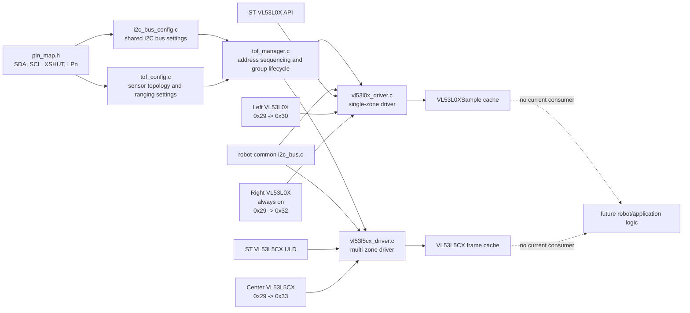

# Time-of-Flight System

## 1. Feature Overview

The time-of-flight (ToF) subsystem provides shared-bus lifecycle management and ranging access for the drivetrain board's three distance sensors:

- A left-side VL53L0X single-zone sensor.
- A right-side VL53L0X single-zone sensor.
- A center VL53L5CX 4x4 multi-zone sensor.

All three devices use I2C address `0x29` after reset. The subsystem prevents startup collisions by holding sensors with controllable shutdown pins off the bus, assigning the always-on right VL53L0X its runtime address first, and then enabling and readdressing the remaining devices one at a time. At runtime, it starts all sensors, polls them without waiting for a new measurement, and stores timestamped results in caller-owned sensor objects.

The subsystem stops at acquisition and validation. It does not fuse the three sensors, classify obstacles, produce avoidance commands, or decide how distance data affects robot behavior.

The driver, manager, and drivetrain topology are implemented and included in the default ESP32 build. However, no application or diagnostic harness currently creates `TofManager` storage, calls the manager lifecycle, or consumes ToF results. The default `src/main.cpp` remains a two-motor duty bench test.

## 2. System Context



`TofManager` is intended to be the subsystem entry point. It owns the I2C bus instance and coordinates both sensor families, while the application owns exact-size arrays of `VL53L0X` and `VL53L5CX` runtime objects. The two drivers adapt the project I2C abstraction to ST's vendor APIs.

The default I2C configuration uses ESP32 I2C port 0, SDA GPIO 8, SCL GPIO 9, a 100 kHz clock, a 50 ms transaction timeout, and no internal pull-ups. Physical pull-ups are therefore expected elsewhere in the hardware.

## 3. Architecture and Layers

### Board configuration

`include/config/pin_map.h`, `include/config/communication/i2c_bus_config.h`, `src/config/communication/i2c_bus_config.c`, `include/config/time_of_flight/tof_config.h`, and `src/config/time_of_flight/tof_config.c` describe this controller's wiring and sensor topology.

This layer assigns physical meanings such as left, right, and center. It also chooses runtime addresses, shutdown pins, measurement profiles, timing budgets, ranging frequency, resolution, target order, and freshness limits. It should not perform I2C traffic or retain measurement history.

### Common device configuration

`include/drivers/time_of_flight/tof_device.h` defines `TofDeviceConfig`, the address and shutdown metadata shared by both sensor families. Addresses are stored in unshifted 7-bit form. Drivers convert them to the 8-bit form required by the ST APIs when necessary.

This type deliberately contains no robot position, sensor-family settings, or runtime state.

### Sensor drivers

`vl53l0x_driver.*` and `vl53l5cx_driver.*` each manage one physical sensor. They validate family-specific configuration, prepare the shutdown pin, bind an `I2cDevice` to the shared bus, initialize the vendor API, assign the runtime address, start and stop ranging, and cache completed measurements.

The drivers own sensor-family details such as VL53L0X calibration/profile setup and VL53L5CX zone-status interpretation. They should not choose group startup order or attach application meaning to a distance.

### ToF manager

`tof_manager.*` owns the shared `I2cBus` and coordinates arrays of both sensor types. It validates whether the configured address topology can be brought up safely, asserts all available shutdown signals, initializes always-on devices before controlled devices, rolls back partial startup, and exposes group `init`, `start`, `poll`, `stop`, and `deinit` operations.

The manager does not allocate sensor arrays. This avoids forcing firmware that uses only VL53L0X devices to reserve the VL53L5CX ULD's large runtime buffers.

### Shared transport and vendor libraries

`../lib/robot-common/include/robot_common/i2c_bus.h` and `../lib/robot-common/src/i2c_bus.c` provide the common ESP-IDF I2C master and addressed-device abstraction. The ST libraries under `lib/st-vl53l0x-api` and `lib/st-vl53l5cx-uld` provide register-level initialization and ranging behavior. Project-specific platform ports connect those libraries to `I2cDevice`.

### Application integration

No current module owns application-level ToF initialization, scheduling, or result consumption. This is a missing integration layer, not a manager responsibility.

## 4. Relevant File Map

| File | Role | Why It Exists |
|---|---|---|
| `include/config/pin_map.h` | Board GPIO map | Defines shared I2C pins, left VL53L0X XSHUT, and center VL53L5CX LPn. |
| `include/config/communication/i2c_bus_config.h` | Bus configuration interface | Exposes the immutable sensor-bus configuration. |
| `src/config/communication/i2c_bus_config.c` | Bus configuration | Selects I2C port, pins, clock, timeout, and pull-up behavior. |
| `include/config/time_of_flight/tof_config.h` | Drivetrain topology interface | Defines left/right/center indices and exposes `DRIVETRAIN_TOF_CONFIG`. |
| `src/config/time_of_flight/tof_config.c` | Drivetrain ToF composition | Defines the two VL53L0X configurations, center VL53L5CX configuration, addresses, profiles, and manager topology. |
| `include/drivers/time_of_flight/tof_device.h` | Shared device metadata | Gives both sensor families the same 7-bit address and shutdown-pin representation. |
| `include/drivers/time_of_flight/vl53l0x_driver.h` | VL53L0X public API and state | Declares profiles, configuration, cached sample state, and lifecycle/read functions. |
| `src/drivers/time_of_flight/vl53l0x_driver.c` | VL53L0X implementation | Owns XSHUT sequencing, address changes, calibration, profiles, continuous ranging, and sample freshness. |
| `include/drivers/time_of_flight/vl53l5cx_driver.h` | VL53L5CX public API and state | Declares grid configuration, ULD runtime storage, cached frame state, and lifecycle/read functions. |
| `src/drivers/time_of_flight/vl53l5cx_driver.c` | VL53L5CX implementation | Owns LPn handling, ULD initialization, address changes, grid setup, frame reads, and zone validity. |
| `include/control/time_of_flight/tof_manager.h` | Group lifecycle contract | Declares topology, caller-owned storage, manager state, and subsystem entry points. |
| `src/control/time_of_flight/tof_manager.c` | Group lifecycle implementation | Validates address safety and coordinates shutdown, initialization, polling, rollback, and teardown. |
| `../lib/robot-common/include/robot_common/i2c_bus.h` | Shared I2C interface | Defines `I2cBusConfig`, `I2cBus`, `I2cDevice`, and transaction APIs used by both drivers. |
| `../lib/robot-common/src/i2c_bus.c` | Shared I2C implementation | Installs the ESP-IDF master driver and executes blocking device transactions with the configured timeout. |
| `lib/st-vl53l0x-api/src/core/inc/vl53l0x_api.h` | VL53L0X vendor API | Supplies ST initialization, calibration, addressing, and ranging calls. |
| `lib/st-vl53l0x-api/src/platform/vl53l0x_platform.c` | VL53L0X platform adapter | Routes ST register operations through the project I2C device. |
| `lib/st-vl53l5cx-uld/src/core/inc/vl53l5cx_api.h` | VL53L5CX vendor API | Supplies the ULD initialization, configuration, addressing, and frame APIs. |
| `lib/st-vl53l5cx-uld/src/platform/platform.c` | VL53L5CX platform adapter | Routes ULD reads and writes through the project I2C device. |
| `platformio.ini` | Build integration | Adds the VL53L5CX ULD include paths and builds ToF sources in the default ESP32 environment. |
| `src/main.cpp` | Current production entry point | Demonstrates that the ToF subsystem is not yet initialized or scheduled by the default firmware. |

### Configuration responsibilities

`tof_config.c` is the correct place to change drivetrain sensor count, physical role, runtime address, shutdown wiring, and ranging parameters. `pin_map.h` should change only when board wiring changes. The generic drivers and manager should remain free of drivetrain-specific names.

The current runtime topology is:

| Index | Device | Shutdown control | Default address | Runtime address | Main settings |
|---|---|---|---:|---:|---|
| `DRIVETRAIN_TOF_LEFT` | VL53L0X | GPIO 21 XSHUT | `0x29` | `0x30` | Default profile, 33 ms timing budget |
| `DRIVETRAIN_TOF_RIGHT` | VL53L0X | None | `0x29` | `0x32` | Default profile, 33 ms timing budget |
| `DRIVETRAIN_TOF_CENTER` | VL53L5CX | GPIO 40 LPn | `0x29` | `0x33` | 4x4, continuous, closest target, 10 Hz |

### Driver responsibilities

`VL53L0X` contains its `I2cDevice`, ST context, latest `VL53L0XSample`, and lifecycle flags. `vl53l0x_driver_read()` consumes one ready measurement and records distance, ST range status, timestamp, and validity. `vl53l0x_driver_get_sample()` returns a fresh cached sample; callers must inspect `sample.valid` because an invalid range status is still useful diagnostic data.

`VL53L5CX` contains its `I2cDevice`, the ULD configuration and work buffers, full result frame, zone-validity mask, timestamp, and lifecycle flags. `vl53l5cx_driver_read()` accepts a zone when at least one target exists and ST target status is 5 or 9. `vl53l5cx_driver_get_distance_mm()` returns only a valid, fresh zone.

### Manager responsibilities

`TofManagerConfig` holds immutable topology pointers and counts. `TofManagerStorage` holds caller-provided arrays. `TofManager` retains both references, owns the initialized bus, and tracks group lifecycle state.

The manager intentionally accesses the two families separately for driver calls but presents them as one flattened topology for address validation and shutdown sequencing. Application-level sensor fusion and obstacle policy remain outside it.

## 5. Design Intent and Rationale

### Generic topology versus drivetrain-specific roles

**Documented intent:** `tof_manager.h` says the manager coordinates a configurable set of sensors without assigning robot-specific meanings, while `tof_config.h` defines the drivetrain's left, right, and center indices.

This boundary keeps the drivers and manager reusable for another controller. For example, arm firmware can supply three VL53L0X configurations and zero VL53L5CX configurations without introducing arm positions into the device drivers. The manager is still explicitly aware of the two supported sensor families, so adding a third family requires manager changes.

### Shared address/shutdown metadata

**Documented intent:** `tof_device.h` defines the address and shutdown settings common to all ToF sensors.

Using `TofDeviceConfig` gives manager validation one consistent view of both device types and avoids duplicating address-format rules. The tradeoff is generic naming: `shutdown_pin` represents XSHUT for VL53L0X and LPn for VL53L5CX.

### Immutable configuration and caller-owned mutable storage

**Documented intent:** Header comments explicitly describe `TofManagerConfig` as topology and `TofManagerStorage` as exact-size storage owned by the application.

The manager stores pointers rather than copying configuration or allocating memory. A likely reason is the large `VL53L5CX_Configuration` and result buffers: firmware that does not use this sensor should not pay its RAM cost. This also permits different boards to choose exact sensor counts.

The tradeoff is a strict lifetime contract. The manager configuration, its sensor-config arrays, and both storage arrays must remain valid and unchanged until `tof_manager_deinit()` completes. Global or static allocation is the natural production pattern.

### Address assignment by shutdown capability

**Documented intent:** The manager API comment states that controllable sensors are held in shutdown and any always-on sensor is initialized first. The drivetrain configuration explicitly marks the right sensor as always on.

This solves the shared `0x29` boot-address problem without hard-coding `RIGHT` into the manager. It also detects impossible configurations, including two always-on devices with the same default address. Controlled devices are deinitialized before always-on devices so powering them down cannot collide with an always-on device restored to `0x29`.

### Cached non-waiting reads

**Inferred intent:** Both drivers separate `read` from cached-data access, and both return `ESP_ERR_NOT_FINISHED` when hardware has no completed result.

This appears intended to let an application poll all devices without waiting for their different ranging periods. The cache lets consumers read the latest result independently from I2C acquisition. Freshness limits prevent old measurements from silently appearing current.

The poll remains synchronous at the I2C transaction level; “non-waiting” means it does not wait for a new ranging result, not that it uses asynchronous I2C.

### Manager-owned bus lifecycle

**Inferred intent:** `TofManager` embeds `I2cBus`, initializes it before any device, and deinitializes it after every device.

This gives the ToF group one owner for ordering and cleanup. The tradeoff is that the current manager assumes exclusive lifecycle ownership of `SENSOR_I2C_BUS_CONFIG`. If unrelated sensors must share the same installed bus, ownership will need to move above `TofManager` or the manager API will need to accept an already initialized bus.

### Error propagation and rollback

**Documented intent:** Manager comments promise rollback on start failure and preservation of the first error during group operations.

Initialization tears down partially initialized sensors and the bus. Start failure stops sensors that were already started. Polling treats “not ready” as normal but returns the first real error. Teardown retains the first stop, device-deinit, or bus-deinit error while still attempting later cleanup.

### Apparent architectural goals

The implementation appears intended to keep board roles in configuration, keep sensor-family details in drivers, centralize shared-address safety in one manager, avoid dynamic allocation, support exact board topologies, and expose validated cached measurements to a future application layer. Those boundaries are internally consistent, but application composition and automated testing are not yet present.

## 6. Initialization Workflow

No current application executes this workflow. The implemented manager path is:

1. The application zero-initializes a `TofManager` and allocates exact-size `VL53L0X` and `VL53L5CX` arrays.
2. The application creates a `TofManagerStorage` pointing to those arrays and calls `tof_manager_init()` with `DRIVETRAIN_TOF_CONFIG`.
3. `topology_is_valid()` checks that:
   - The bus configuration, topology arrays, and required storage pointers exist.
   - At least one device is configured.
   - All addresses are valid nonzero 7-bit addresses.
   - Runtime target addresses are unique.
   - A target address does not collide with another device's boot address.
   - No two devices without shutdown control share a boot address.
4. The manager clears its state and both caller-owned sensor arrays.
5. `hold_controllable_sensors()` configures every available shutdown pin as an output, drives it low, and waits 5 ms.
6. `i2c_bus_init()` installs the ESP-IDF I2C master using `SENSOR_I2C_BUS_CONFIG`.
7. `init_devices(manager, false)` initializes devices with no shutdown control. In the current topology this is the right VL53L0X, which moves from `0x29` to `0x32`.
8. `init_devices(manager, true)` initializes controlled devices. The current loop initializes the left VL53L0X at `0x29`, moves it to `0x30`, then initializes the center VL53L5CX and moves it to `0x33`.
9. The manager marks itself initialized.

VL53L0X initialization performs these family-specific steps:

1. If XSHUT is controlled, configure it, pulse it low, drive it high, and observe two 5 ms delays.
2. Bind `I2cDevice` to the shared bus at the default address.
3. Configure the ST context and call `VL53L0X_DataInit()`.
4. Change the hardware address when default and target differ; the wrapper updates both its 7-bit transport address and the ST context.
5. Read device information and require product revision 1.1.
6. Run static initialization, reference SPAD management, and reference calibration.
7. Apply the selected profile and measurement timing budget.

VL53L5CX initialization performs these family-specific steps:

1. If LPn is controlled, configure it high and wait 10 ms.
2. Bind `I2cDevice` at the default address and attach it to the ULD platform object.
3. Verify that the sensor is alive.
4. Run the ULD's `vl53l5cx_init()` sequence.
5. Change the device address when required.
6. Apply resolution, ranging mode, frequency, optional autonomous integration time, sharpener, and target order.

If initialization fails after the bus is installed, the manager deinitializes controlled devices first, then always-on devices, deletes the bus driver, clears manager state, and returns the original failure. A controlled sensor is driven low during driver failure cleanup. An always-on sensor that was already readdressed is asked to return to its default address.

## 7. Runtime Workflow

### Starting ranging

`tof_manager_start()` starts every VL53L0X and then every VL53L5CX. VL53L0X devices enter continuous ranging mode; the VL53L5CX begins frame acquisition using its configured mode. Both drivers invalidate data from a previous run.

If any start fails, `stop_active_devices()` stops sensors that already report `ranging == true`, and the original start error is returned. The manager remains initialized but not ranging.

### Polling

`tof_manager_poll()` is the repeated acquisition entry point:

1. Each VL53L0X checks `VL53L0X_GetMeasurementDataReady()`.
2. A ready sensor reads the ranging record, clears the sensor interrupt condition, timestamps the result, and caches distance, range status, and validity.
3. Each VL53L5CX calls `vl53l5cx_check_data_ready()`.
4. A ready grid sensor reads the complete frame and rebuilds `valid_zone_mask` from target count and target status.
5. The manager returns:
   - `ESP_OK` if at least one sensor produced new data and no real error occurred.
   - `ESP_ERR_NOT_FINISHED` if no sensor produced new data.
   - The first non-`ESP_ERR_NOT_FINISHED` error if any driver failed.

The manager does not combine results into one output structure. Callers read the storage arrays using `DRIVETRAIN_TOF_LEFT`, `DRIVETRAIN_TOF_RIGHT`, and `DRIVETRAIN_TOF_CENTER`, then call the family-specific cached accessor.

### Consuming cached data

`vl53l0x_driver_get_sample()` returns a sample only if one has been captured and its age is no greater than `stale_after_ms`. The returned `VL53L0XSample.valid` is true only for ST range status 0.

`vl53l5cx_driver_get_distance_mm()` checks the requested zone index, requires a captured frame, requires the zone's validity bit, and requires the frame to remain within its freshness limit.

### Stopping and teardown

`tof_manager_stop()` stops active VL53L5CX devices and then active VL53L0X devices, retaining the first error. `tof_manager_deinit()` stops the group when needed, deinitializes controlled devices before always-on devices, deletes the shared bus, clears manager state, and returns the first teardown error encountered.

Controlled devices finish in shutdown. Always-on devices are asked to return to their configured default address so a later initialization can find them at the expected boot address.

## 8. Data Flow


### Configuration data

`DRIVETRAIN_TOF_CONFIG` is a global `const TofManagerConfig`. It points to file-static `const` arrays in `tof_config.c` and to `SENSOR_I2C_BUS_CONFIG`. `TofManager` retains the configuration pointer for its entire initialized lifetime. Each sensor runtime object similarly retains a pointer to its family configuration.

Configuration is passed by pointer and never copied into the drivers. It must remain alive and immutable until teardown; the current global definitions satisfy that requirement.

### Runtime storage

The application supplies mutable arrays through `TofManagerStorage`. `tof_manager_init()` clears those arrays and copies their pointers into the manager. The drivers then modify individual objects in place:

- `VL53L0X` owns the project I2C handle, vendor context, latest sample, and lifecycle flags.
- `VL53L5CX` owns the project I2C handle, ULD context/work buffers, result frame, zone mask, timestamp, and lifecycle flags.

The manager owns neither array memory and does not free it. Storage must outlive the initialized manager.

### Address data

Project configuration and `I2cDevice` use unshifted 7-bit addresses. The VL53L0X driver shifts the target left before calling `VL53L0X_SetDeviceAddress()`. The VL53L5CX driver shifts before calling `vl53l5cx_set_i2c_address()`. Each wrapper then keeps the project transport synchronized with the hardware address.

## 9. Control Flow and Scheduling

The subsystem has no dedicated FreeRTOS task, interrupt handler, callback, or scheduler. Its public API is synchronous and caller-driven:

- `tof_manager_init()` runs once before use.
- `tof_manager_start()` runs once per ranging session.
- `tof_manager_poll()` must be called repeatedly by an application loop or task.
- Cached accessors may run after successful polls.
- `tof_manager_stop()` ends a ranging session.
- `tof_manager_deinit()` releases devices and the bus.

No repository code defines the actual poll period. The center grid is configured for 10 Hz, while each VL53L0X uses a 33 ms measurement budget. These settings describe sensor production rates, not a manager schedule.

Polling is non-waiting with respect to measurement readiness: a device that is still ranging returns `ESP_ERR_NOT_FINISHED`. I2C commands themselves are blocking ESP-IDF calls and use the bus's 50 ms transaction timeout.

Initialization is blocking. It includes explicit 5 ms and 10 ms power/address delays plus ST initialization and calibration sequences. VL53L0X stop is also potentially blocking: it polls stop completion every 1 ms until the configured 100 ms timeout.

No locking protects the manager, bus, vendor objects, or result caches. The implementation is suitable for one owning loop/task. Concurrent polling, access, start/stop, or other use of the same I2C bus would require external serialization.

## 10. State and Ownership

### Immutable state

- `SENSOR_I2C_BUS_CONFIG` owns bus pins and timing.
- File-static arrays in `tof_config.c` own sensor settings.
- `DRIVETRAIN_TOF_CONFIG` owns topology pointers and counts.
- The initialized manager and drivers retain pointers to these objects.

### Application-owned mutable state

The future application must allocate:

```c
static TofManager tof_manager;
static VL53L0X vl53l0x_storage[DRIVETRAIN_VL53L0X_COUNT];
static VL53L5CX vl53l5cx_storage[DRIVETRAIN_VL53L5CX_COUNT];

static const TofManagerStorage tof_storage = {
    .vl53l0x = vl53l0x_storage,
    .vl53l5cx = vl53l5cx_storage,
};
```

This example shows the required ownership shape; it is not present in current application code.

`TofManager` owns its embedded `I2cBus` lifecycle and copies the two storage pointers. It does not own the pointed-to memory. Sensor indices are stable because configuration arrays and runtime arrays use matching ordering.

### Reset and recovery state

Initialization clears manager and sensor storage. Starting clears cached-data availability. Stopping invalidates cached data. Deinitialization clears every initialized driver object and finally the manager.

On partial initialization failure, successfully initialized devices are deinitialized before the bus is deleted. GPIO-controlled devices remain low. Always-on devices cannot be physically reset; the driver attempts to restore their default address through I2C.

## 11. Error and Edge-Case Handling

### Invalid arguments and lifecycle states

Public functions reject null pointers with `ESP_ERR_INVALID_ARG`. They use `ESP_ERR_INVALID_STATE` for operations such as starting an uninitialized device, starting an already ranging group, reading while stopped, or stopping an inactive group.

The manager requires the caller to zero-initialize `TofManager` before first use because `tof_manager_init()` checks `manager->initialized` before clearing it.

### Invalid or impossible topology

`topology_is_valid()` rejects missing storage, zero devices, invalid addresses, duplicate targets, targets that overlap another device's default address, and multiple always-on devices sharing a default address. These checks occur before GPIO or I2C initialization.

The current hardware is valid because only the right VL53L0X lacks shutdown control. The left sensor and center grid are held low while the right sensor leaves `0x29`.

### Device absence and communication failures

I2C and vendor errors are returned as `esp_err_t`. The VL53L5CX explicitly checks `is_alive` and returns `ESP_ERR_NOT_FOUND` when the device does not respond as alive. The VL53L0X checks device information after its initial vendor setup and rejects revisions other than 1.1 as unsupported.

Vendor invalid-parameter, timeout, unsupported-mode, corrupt-frame, and CRC errors receive specific ESP error mappings where available. Other vendor failures collapse to `ESP_FAIL`.

### No completed measurement

Both read functions return `ESP_ERR_NOT_FINISHED` when the sensor reports no completed result. The manager treats this as normal and returns it only when no device updated and no real error occurred.

### Invalid and stale measurements

VL53L0X range-status failures are stored with `sample.valid == false`; they are not treated as I2C failures. VL53L5CX zones without a detected target or accepted target status are excluded from `valid_zone_mask`.

The single-zone cache expires after 150 ms, and the center frame expires after 300 ms. Accessors report `ESP_ERR_INVALID_STATE` for missing, invalid-zone, or stale data.

### Partial start and stop failures

A group start failure triggers best-effort rollback of sensors whose `ranging` flag is set. The rollback error is discarded in favor of the original start failure.

`tof_manager_stop()` clears the manager's `ranging` flag even if a driver stop fails. The individual sensor may retain `ranging == true`, and `tof_manager_deinit()` will attempt to stop it again through the driver. Restarting the manager without deinitializing after such a failure may return `ESP_ERR_INVALID_STATE` from that sensor.

### Address restoration failure

An always-on device is restored to its default address during failure cleanup and deinitialization. During normal deinitialization, restoration errors are propagated. During initialization rollback, restoration errors are secondary to the original failure and are not reported separately. If restoration fails, the next initialization still assumes the device is at its configured default address.

## 12. Integration with the Rest of the Project

The subsystem currently integrates with build infrastructure and shared hardware utilities, but not with application behavior:

- `platformio.ini` builds the manager, drivers, vendor libraries, and platform adapters in the default ESP32 environment.
- `DRIVETRAIN_TOF_CONFIG` composes ToF settings with `SENSOR_I2C_BUS_CONFIG` and `pin_map.h`.
- Both drivers use the shared `robot-common` I2C abstraction.
- `src/main.cpp` does not include any ToF header or call any ToF symbol.
- No harness includes the ToF manager.
- No drivetrain, tape-following, communication, or state-machine module consumes distance data.
- No test directory contains ToF tests, and the native PlatformIO source filter excludes all ToF modules.

When tracing future integration, start with these symbols:

1. `DRIVETRAIN_TOF_CONFIG` for the physical topology.
2. `tof_manager_init()` for address-safe startup.
3. `tof_manager_start()` and `tof_manager_poll()` for scheduling.
4. `vl53l0x_driver_get_sample()` and `vl53l5cx_driver_get_distance_mm()` for data consumption.
5. The future application owner that allocates `TofManagerStorage` and decides how readings affect robot behavior.

## 13. Extension Points

### Supporting the arm's three VL53L0X sensors

The generic manager already supports a topology with three VL53L0X configurations and zero VL53L5CX configurations. Arm firmware would define its own role enum, immutable configuration array, `TofManagerConfig`, three-element runtime array, and null VL53L5CX storage pointer with count zero.

The address-safety rule remains the same: when all sensors boot at `0x29`, all but at most one must have an independently controlled shutdown pin.

The driver and manager interfaces should remain stable. Only the arm's pin map, I2C bus configuration, and ToF topology should be board-specific.

### Changing drivetrain sensor settings

Change `src/config/time_of_flight/tof_config.c` for addresses, profiles, timing budget, freshness, resolution, frequency, or target order. Change `include/config/pin_map.h` only for wiring.

### Adding sensors of an existing family

Increase the appropriate count, add configuration entries, and allocate matching runtime storage. Verify that all targets are unique and startup shutdown control is sufficient. The manager loops are count-driven.

### Adding another sensor family

Create a family-specific driver following the same lifecycle/cache boundary, then extend `TofManagerConfig`, `TofManagerStorage`, topology flattening, and every group lifecycle loop. The manager currently knows VL53L0X and VL53L5CX explicitly; there is no generic function-table device interface.

### Adding application-level interpretation

A sensing or behavior module can consume cached samples and produce obstacle distances, occupancy, collision warnings, or motion constraints. That logic should use the driver accessors and should not perform vendor API or GPIO operations directly.

### Adding tests

Topology validation and manager sequencing are candidates for host tests if GPIO, I2C, timing, and driver lifecycle calls are injected or stubbed. Driver-level tests can use hardware acceptance firmware or a fake I2C/vendor layer. Current public runtime structs also allow cached-accessor tests without hardware.

### Sharing the bus with unrelated devices

The current manager owns installation and deletion of the bus. If other subsystems need the same bus concurrently, introduce a higher-level bus owner and let the manager reference an already initialized bus, or add explicit shared-bus ownership semantics. Do not initialize the same ESP-IDF I2C port independently from two managers.

## 14. Current Limitations and Missing Components

### Confirmed Gaps

- No application or harness initializes, starts, polls, stops, or deinitializes `TofManager`.
- No module consumes `VL53L0XSample` or VL53L5CX zone distances.
- No obstacle interpretation, sensor fusion, filtering, or motion-safety behavior exists above the drivers.
- No automated ToF tests exist.
- The native build excludes the ToF subsystem.
- No hardware acceptance harness probes address assignment, calibration, frame validity, or teardown/reinitialization.
- The right VL53L0X has no XSHUT connection, so software cannot physically reset it.
- The subsystem uses polling only; configured interrupt signals are not represented or used.
- There is no logging identifying which indexed sensor failed during a group operation.

### Potential Concerns

- **Bus ownership:** `TofManager` deletes the I2C driver during teardown. This is safe only while it is the sole lifecycle owner of that bus.
- **Concurrency:** No locks protect the shared bus or sensor state. This is safe under a single caller but would race across tasks.
- **Stop failure state:** The group marks itself not ranging even when a device stop fails, which may complicate retry without deinitialization.
- **Always-on recovery:** A failed attempt to restore the right sensor to `0x29` can leave software and hardware address expectations out of sync.
- **VL53L0X revision restriction:** Only product revision 1.1 is accepted. It is unclear whether all intended modules are guaranteed to report this revision.
- **VL53L5CX RAM usage:** Caller-owned storage avoids imposing it on configurations with count zero, but every configured grid sensor still carries the full ULD work buffers and result structure.

### Recommendations

1. Add a small ToF hardware harness before production integration. Verify boot order, addresses `0x30`/`0x32`/`0x33`, restart behavior, and real target-status handling.
2. Add host tests for topology validation, partial-init rollback, start rollback, poll aggregation, freshness boundaries, and teardown error precedence.
3. Integrate one statically allocated manager into the future robot application and define an explicit poll period appropriate for 10 Hz grid data and 33 ms single-zone measurements.
4. Add application-level status that identifies the failing family/index instead of exposing only the first `esp_err_t`.
5. Require deinitialization after a stop failure, or keep manager `ranging` true while any child sensor remains active.
6. Confirm that ToF exclusively owns I2C port 0 before adding other I2C peripherals.

## 15. Example Runtime Sequence

The following is the intended sequence using current symbols; no current application implements it:

1. Static application storage supplies two `VL53L0X` objects, one `VL53L5CX` object, and a zero-initialized `TofManager`.
2. The application calls `tof_manager_init(&tof_manager, &DRIVETRAIN_TOF_CONFIG, &tof_storage)`.
3. The manager holds the left and center devices low, initializes the bus, moves the always-on right sensor from `0x29` to `0x32`, then assigns `0x30` and `0x33` to the controlled devices.
4. The application calls `tof_manager_start(&tof_manager)`.
5. On each scheduled update, the application calls `tof_manager_poll(&tof_manager)`.
6. A poll may update either side sample, the center frame, several devices, or none.
7. The application calls `vl53l0x_driver_get_sample(&vl53l0x_storage[DRIVETRAIN_TOF_LEFT], &sample)` and checks `sample.valid`.
8. The application calls `vl53l5cx_driver_get_distance_mm(&vl53l5cx_storage[DRIVETRAIN_TOF_CENTER], zone, &distance_mm)` for required center zones.
9. Future behavior logic interprets those distances; no such consumer currently exists.
10. On shutdown, the application calls `tof_manager_stop()` and `tof_manager_deinit()`.

## 16. Developer Reading Order

1. **`include/config/time_of_flight/tof_config.h`** — Learn the drivetrain's semantic indices and the exported topology object.
2. **`src/config/time_of_flight/tof_config.c`** — See the actual three devices, addresses, shutdown wiring, and ranging parameters. This makes the startup problem concrete before reading generic code.
3. **`include/control/time_of_flight/tof_manager.h`** — Understand topology, storage ownership, manager state, and the public group lifecycle.
4. **`src/control/time_of_flight/tof_manager.c`** — Follow address validation, always-on-first initialization, rollback, polling aggregation, and teardown ordering.
5. **`include/drivers/time_of_flight/tof_device.h`** — Confirm the shared 7-bit address and shutdown representation used by both families.
6. **`include/drivers/time_of_flight/vl53l0x_driver.h`** — Learn the single-zone configuration, cache, and accessor contract.
7. **`src/drivers/time_of_flight/vl53l0x_driver.c`** — Trace XSHUT, address assignment, calibration/profile setup, continuous ranging, and freshness.
8. **`include/drivers/time_of_flight/vl53l5cx_driver.h`** — Learn the multi-zone configuration, ULD-owned runtime storage, result frame, and accessor contract.
9. **`src/drivers/time_of_flight/vl53l5cx_driver.c`** — Trace LPn, ULD initialization, grid configuration, frame reads, and valid-zone masking.
10. **`include/config/communication/i2c_bus_config.h` and `src/config/communication/i2c_bus_config.c`** — Understand the shared bus's electrical and timing settings.
11. **`../lib/robot-common/include/robot_common/i2c_bus.h` and `../lib/robot-common/src/i2c_bus.c`** — Understand the blocking transport and lifecycle beneath both drivers.
12. **`platformio.ini`** — See vendor include-path requirements and confirm that ToF is built only for the ESP32 environment, not native tests.
13. **`src/main.cpp`** — Confirm the current integration gap and identify where a future application owner is still needed.
